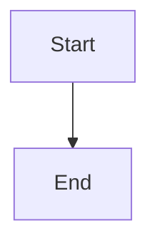
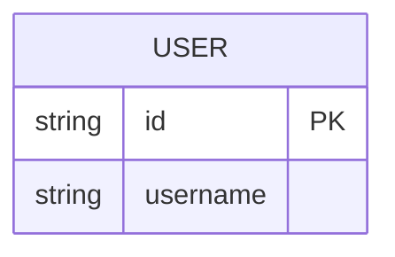
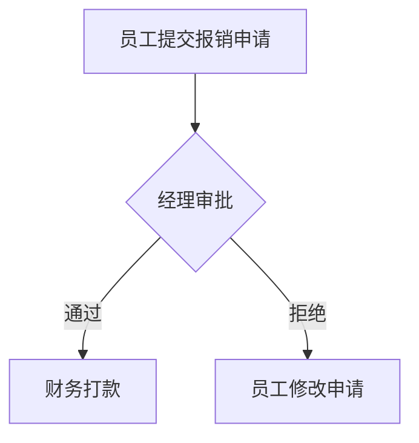
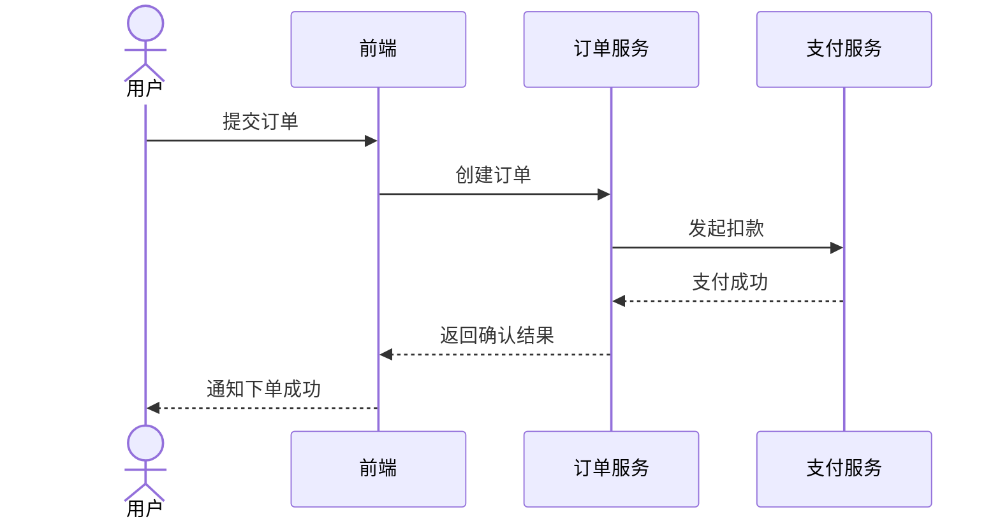
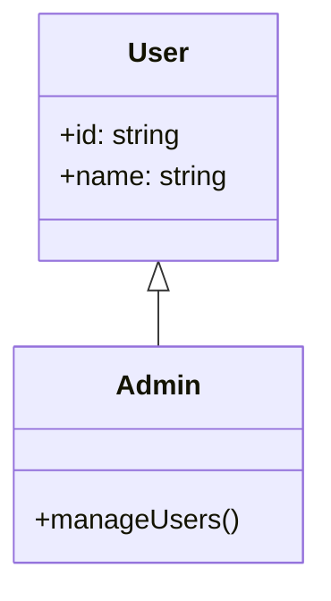
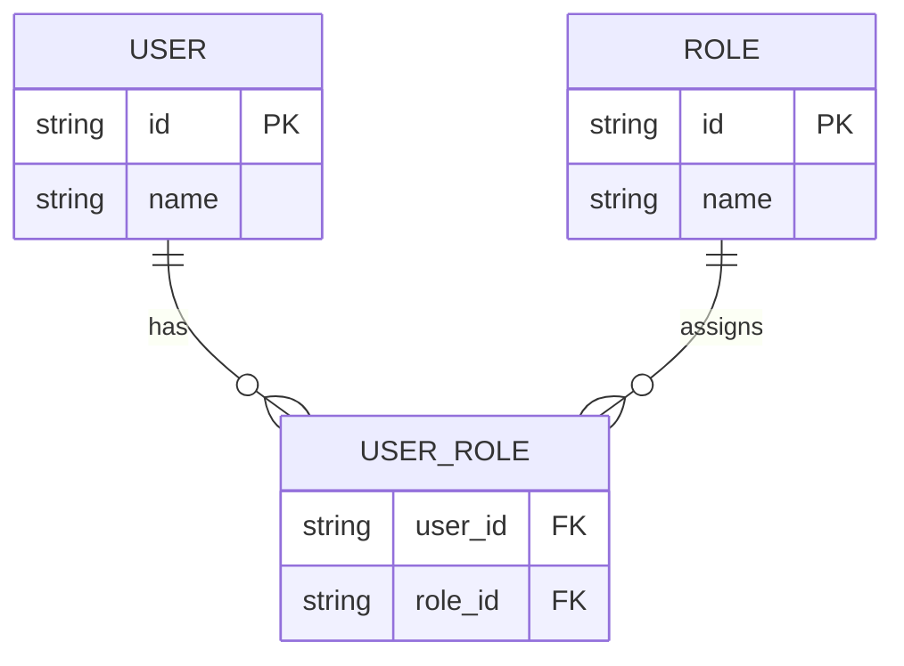
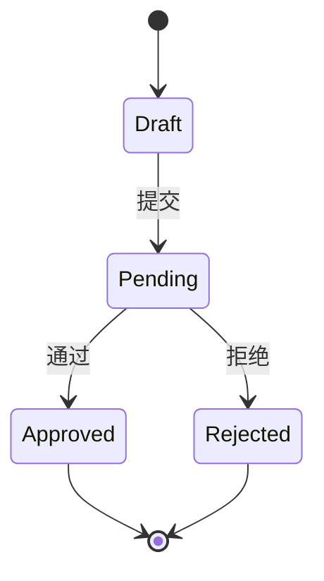
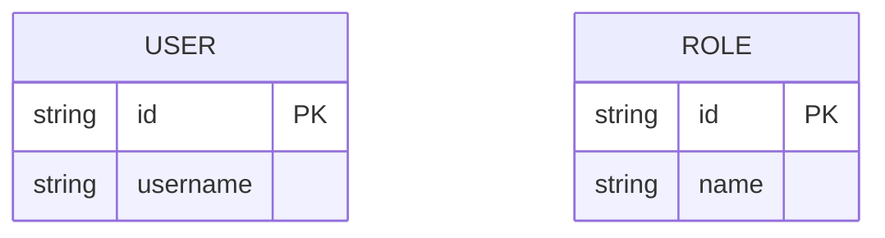
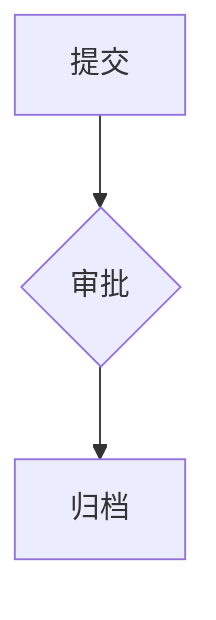
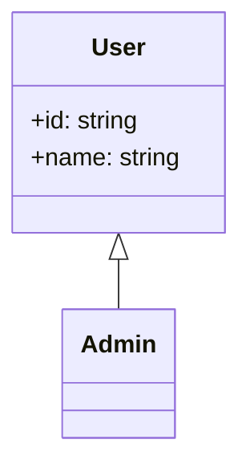

# Mermaid Source Generator and Structured Editor

Generate Mermaid source code directly from user intent and support targeted edits to specific Mermaid elements. Prefer directly renderable Mermaid output. Do not output JSON as the primary result.

## Supported Diagram Types

Support these Mermaid diagram families:

- `flowchart`
- `sequenceDiagram`
- `classDiagram`
- `erDiagram`
- `stateDiagram-v2`

If the user requests another Mermaid family, do not invent a partial result. Explain that the requested type is not supported yet and offer one of the supported types instead.

## Task Modes

Support two modes:

- **Generation mode**: create a Mermaid diagram from natural language
- **Edit mode**: modify a specific field or element in an existing Mermaid diagram or a clearly referenced current diagram structure

Use **edit mode** when any of the following is true:

- the user provides existing Mermaid source
- the user asks to change, replace, rename, add, remove, delete, update, or move a specific part of a Mermaid diagram
- the user refers to a concrete target such as a node, entity, field, method, participant, relation, state, transition, or label

Use **generation mode** when the user is asking to create a Mermaid diagram from scratch and no edit intent is present.

## Workflow

1. Detect whether the request is generation mode or edit mode.
2. Extract the concrete entities, relationships, ordering, and target elements from the request.
3. Check whether the user explicitly specified a Mermaid diagram type.
4. If the diagram type is missing, ask a concise clarification question instead of guessing.
5. In edit mode, identify the exact target by path or by name before changing anything.
6. If the target is ambiguous, ask a clarification question instead of guessing.
7. Fill only the minimum missing details required to produce valid Mermaid source.
8. Preserve the user’s domain language in labels, state names, entity names, field names, and messages.
9. Return Mermaid output in the correct format for the current mode.

## Edit Inputs

In edit mode, accept either of these inputs:

- existing Mermaid source code supplied by the user
- natural language instructions that refer to a known current Mermaid structure

When Mermaid source is present, treat it as the authoritative editing context.
When Mermaid source is not present, only edit what is clearly identified from the active diagram context described by the user. If the context is not sufficient, ask for clarification.

## Element Targeting Rules

Support both of these targeting styles:

- **name-based targeting**: identify a target by its displayed name or logical name
- **path-based targeting**: identify a target by an explicit structural path

Examples of valid path-style references:

- `entity.USER.fields.name`
- `entity.USER_ROLE.fields.role_id`
- `class.User.methods.manageUsers`
- `class.Admin.attributes.id`
- `node.Approval.label`
- `relation.USER_ROLE.assigned_to`
- `participant.订单服务`
- `message.订单服务->支付服务`
- `state.Pending`
- `transition.Pending->Approved`

Targeting rules:

- if both path-based and name-based references are present, prefer the path
- if a name uniquely identifies one target, you may edit it directly
- if multiple targets match the same name, ask a clarification question
- never guess among multiple matching fields, nodes, relations, methods, or states
- preserve all non-targeted structure unless a minimal dependent change is required to keep the Mermaid valid

## Supported Edit Operations

Support these operation types:

- **update**: rename, relabel, change a field value, change a message text, change a relation label, change a direction token, change PK or FK markers, change a cardinality, or change a state transition label
- **add**: add a node, edge, field, participant, message, note, class, method, attribute, entity, relation, state, or transition
- **delete**: remove a node, edge, field, participant, message, note, class, method, attribute, entity, relation, state, or transition

Edit rules:

- modify only the explicitly requested target and the minimum required dependent syntax
- do not silently redesign the full diagram
- do not rename unrelated elements for consistency unless the user asked for it
- when a deletion requires cleanup of dependent relations or transitions, make only the minimum valid cleanup and record it in the diff list

## Clarification Rules

Ask the user a short clarification question when any of the following is true:

- the user wants a Mermaid diagram but did not specify the diagram type
- the request could map to multiple supported diagram types
- the structure is too vague to produce valid Mermaid source safely
- an edit target is not uniquely identifiable
- the user asks to change a field or element that appears multiple times
- the user refers to “this node”, “that field”, or similar wording without enough context
- the requested deletion or update could affect multiple possible relations or transitions

When clarification is required:

- ask what Mermaid diagram type they want
- if helpful, offer supported choices: `flowchart`, `sequenceDiagram`, `classDiagram`, `erDiagram`, `stateDiagram-v2`
- do not generate placeholder Mermaid code before the user answers
- do not auto-infer the diagram type
- in edit mode, ask for the missing target name, path, or source context instead of guessing

## Output Rules

In **generation mode**, return exactly one Mermaid code block:

````markdown

````

In **edit mode**, return the updated Mermaid code block first, then a short diff list.

Edit mode output shape:

````markdown


- 更新: entity.USER.fields.name → username
````

Output rules:

- use a Mermaid fenced code block with the `mermaid` language tag
- do not wrap the Mermaid block in JSON
- keep the source directly renderable
- do not include unsupported Mermaid syntax
- do not invent business logic, actors, entities, states, or branches that the user did not provide or strongly imply
- in generation mode, do not add introductory or trailing explanation around the code block
- in edit mode, keep the diff list concise and place it after the Mermaid block
- each diff item should state the operation type, target element, and concrete change

## Type-Specific Guidance

### Flowchart

Use `flowchart` when the user describes a process, workflow, branching path, approval, routing path, or static relationship layout.

Rules:

- choose a direction token only after the type is known
- default to `TB` when the user does not express a layout preference
- use square nodes for standard steps and entities when no special shape is required
- use diamond-style decision nodes only for explicit decision points
- keep edges in the natural traversal order
- keep labels short and domain-accurate
- editable targets include node IDs, node labels, relations, relation labels, direction tokens, and explicit decision branches
- support target references such as `node.Approval`, `node.Approval.label`, `relation.Approval->Archive`, or a natural-language name like “审批节点”

Example:



### Sequence

Use `sequenceDiagram` when the user describes time-ordered interactions between actors, users, services, APIs, databases, or systems.

Rules:

- declare each actor or participant before messages
- preserve message order exactly
- use `->>` for normal request flow unless the user implies asynchronous behavior
- use `-->>` for replies or result returns
- add `Note` only when the user provided an important remark or one short note is required to preserve meaning
- editable targets include actors, participants, messages, message labels, notes, and message direction
- support target references such as `participant.订单服务`, `message.前端->订单服务`, or a natural-language name like “返回确认结果这条消息”

Example:



### Class Diagram

Use `classDiagram` when the user describes classes, attributes, methods, inheritance, implementation, association, aggregation, or composition.

Rules:

- create one class block per named class
- include attributes and methods only when the user states them or they are necessary to preserve the described structure
- preserve inheritance and association direction correctly
- avoid fabricating visibility modifiers unless the user gives them or they are clearly implied by the example style
- editable targets include classes, attributes, methods, inheritance lines, and associations
- support target references such as `class.User`, `class.User.attributes.name`, `class.Admin.methods.manageUsers`, or a natural-language name like “Admin 的 manageUsers 方法”

Example:



### ER Diagram

Use `erDiagram` when the user describes entities, fields, cardinality, primary keys, foreign keys, or database-style relationships.

Rules:

- model stable business objects as entities
- include fields only when they are present in the request or are required for a minimal intelligible entity definition
- preserve relationship cardinality from the request
- use concise field declarations and keep database semantics clear
- editable targets include entities, fields, PK or FK markers, relation cardinalities, and relation labels
- support target references such as `entity.USER`, `entity.USER.fields.name`, `entity.USER_ROLE.fields.role_id`, or a natural-language name like “USER 的 name 字段”

Example:



### State Diagram

Use `stateDiagram-v2` when the user describes states, transitions, lifecycle progression, start or end states, or event-driven movement between states.

Rules:

- include start and end states when they are explicit or required for a coherent lifecycle
- keep transition labels short and event-oriented
- do not invent hidden states or rollback paths
- preserve lifecycle direction from the request
- editable targets include states, transitions, start or end markers, and transition labels
- support target references such as `state.Pending`, `transition.Pending->Approved`, or a natural-language name like “Pending 到 Approved 的转移”

Example:



## Minimal Gap-Filling Rules

Fill only what is necessary to produce valid Mermaid source after the type is known.

Good gap-filling:

- defaulting a flowchart direction to `TB`
- choosing `participant` instead of `actor` for a named backend service
- adding an end state marker when the lifecycle description clearly finishes
- removing the minimum dependent relation after deleting an entity or state
- using an explicit path target when the user provided one

Bad gap-filling:

- inferring a diagram type when the user did not choose one
- inventing retries, approvals, exception paths, entities, fields, or messages
- expanding a simple request into a much richer business model than the user described
- guessing which of several same-named targets the user intended to edit

## Unsupported Handling

If the user asks for an unsupported Mermaid family:

- state that the requested type is not supported by this skill yet
- ask whether they want one of these instead: `flowchart`, `sequenceDiagram`, `classDiagram`, `erDiagram`, `stateDiagram-v2`
- do not output incorrect Mermaid code for the unsupported type

## Edit Examples

### ER Field Rename

Input intent:

`把 USER.name 改成 username`

Output:



- 更新: entity.USER.fields.name → username

### Flowchart Relation Add

Input intent:

`给审批节点新增一条到归档节点的连线`

Output:



- 新增: relation.审批->归档

### Class Method Delete

Input intent:

`删除 Admin.manageUsers()`

Output:



- 删除: class.Admin.methods.manageUsers

### Ambiguous Name Requires Clarification

If the user says `把 name 改成 username` and the current diagram contains multiple `name` fields, ask which exact target they want, such as `entity.USER.fields.name` or `entity.ROLE.fields.name`, instead of editing immediately.

## Final Self-Check

Before returning the result, verify:

- frontmatter contains only `name` and `description`
- `description` states both capability and trigger conditions
- success output is Mermaid source, not JSON
- the first Mermaid line matches the selected diagram family
- the code block is directly renderable
- labels preserve the user’s domain wording where possible
- unsupported or ambiguous requests trigger clarification instead of guesswork
- edit mode correctly distinguishes name-based and path-based targets
- edit mode supports add, delete, and update operations
- edit mode returns a concise diff list after the updated Mermaid block
