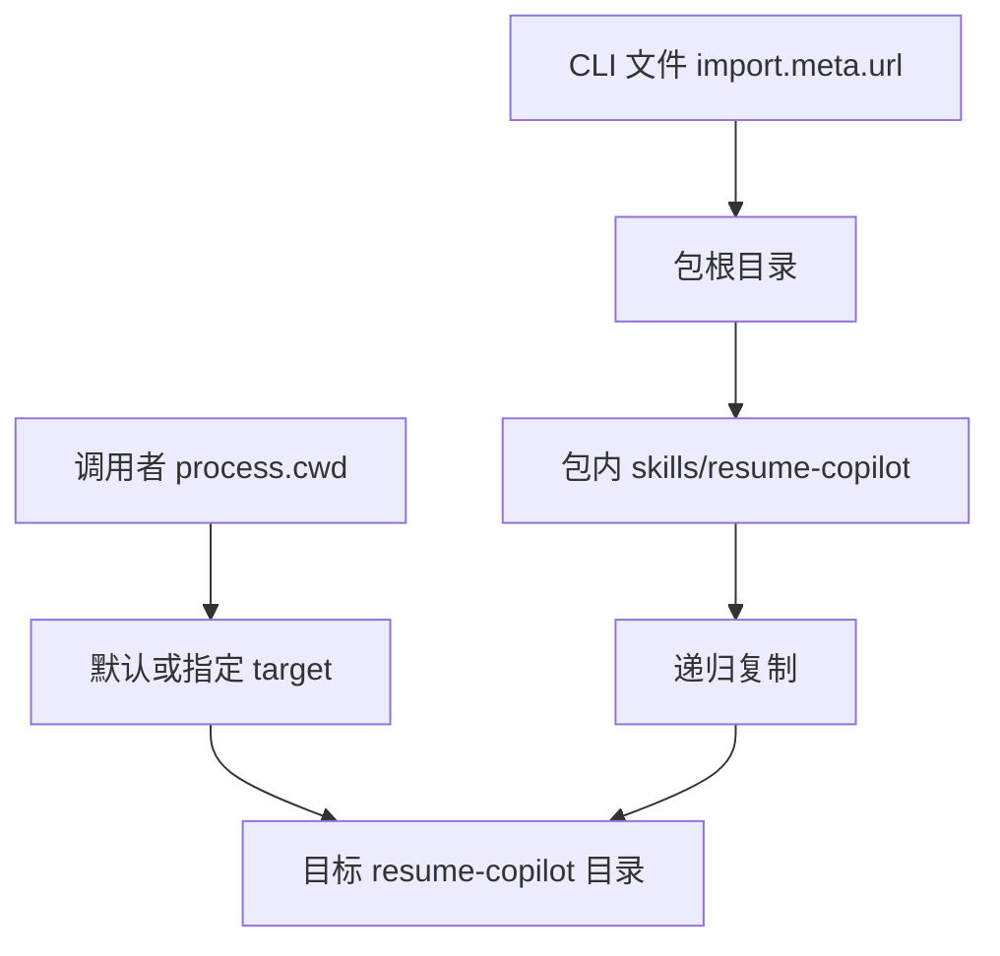
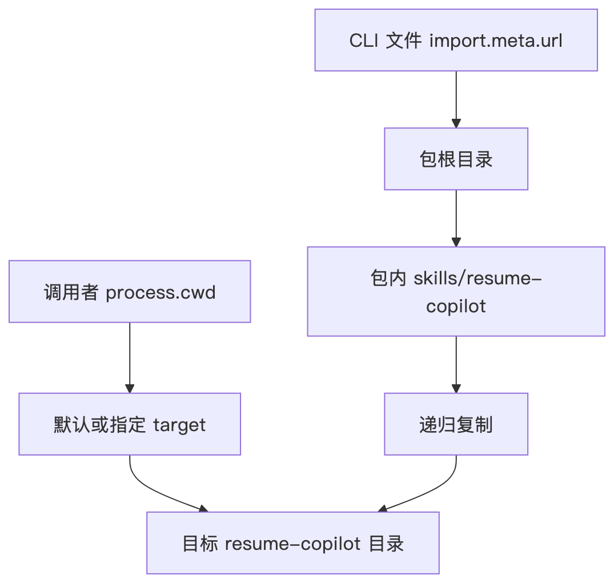
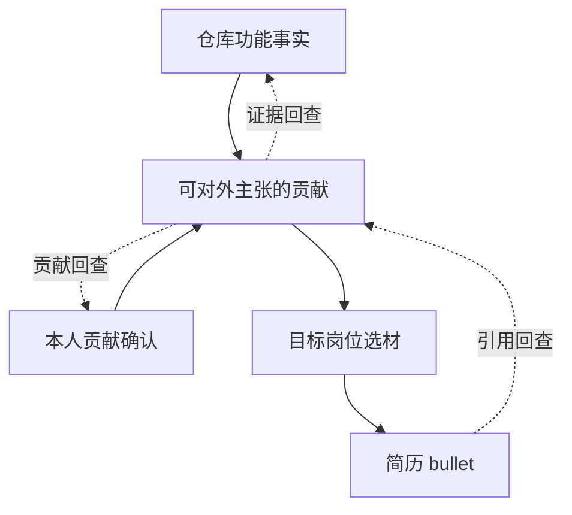
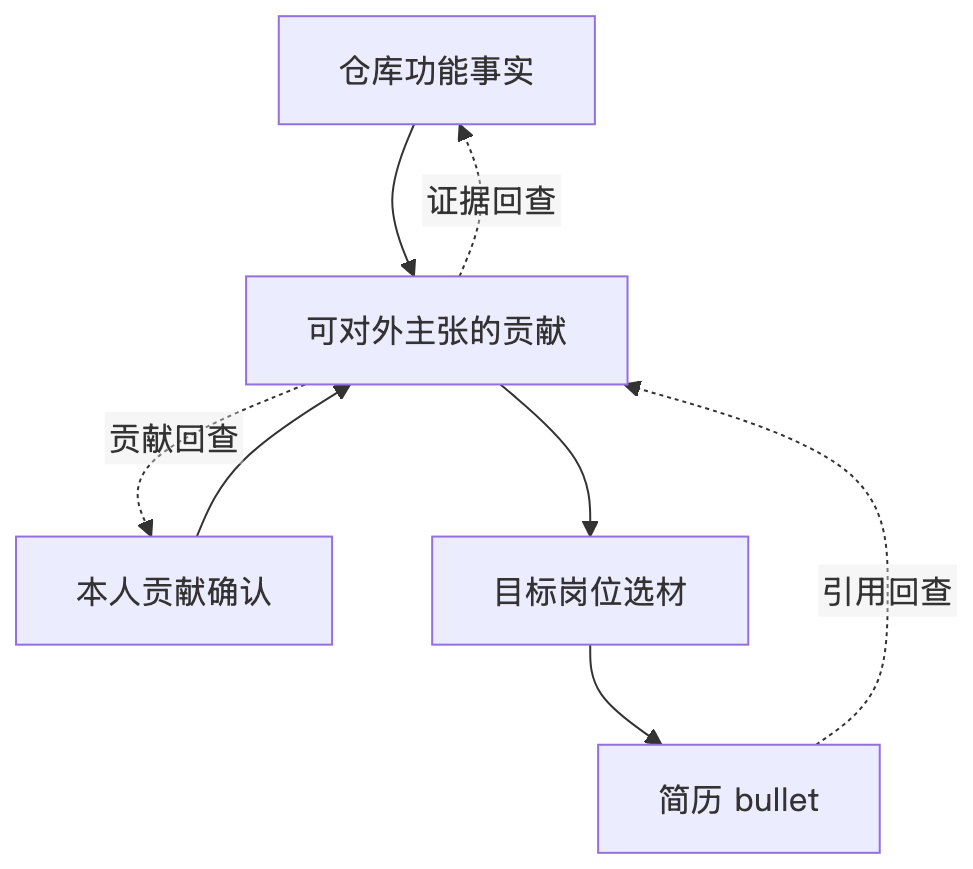

# 后端开发工程师｜简历面试问题预设（新版）

这份参考稿只依据当前简历展示的 `fish-skill` 项目、对应职业事实和仓库实现重新生成。回答采用候选人可口述的表达方式；其中“我做了”对应已确认的个人项目与可核对的代码，“如果改造，我会”表示设计思路，不代表项目已经实现。参考答案仍需由你理解后用自己的话复述。

# 一、Node.js CLI：从命令执行到文件落地

## 如果在另一个项目目录执行 `fish-skill install resume-copilot`，你的 CLI 怎样找到源文件，又把它装到哪里？

我把**包内资源位置**和**用户指定的安装位置**分开处理。CLI 自己的文件位置是稳定的，所以我从 `import.meta.url` 得到入口文件路径，再向上定位包根目录和 `skills/`。用户的目标目录则以执行命令时的当前工作目录为基准解析；不传 `--target` 时，默认装进该目录下的 `.agents/skills/resume-copilot`。这样命令从别的项目运行，也不会跑去那个项目里寻找包自带的 Skill。

例如包位于 `/opt/fish-skill`，我在 `/work/demo` 运行 `fish-skill install resume-copilot`：复制源是 `/opt/fish-skill/skills/resume-copilot`，目标是 `/work/demo/.agents/skills/resume-copilot`。如果把两者都建立在 `process.cwd()` 上，源会错误地指向 `/work/demo/skills`；如果把目标也建立在包目录上，Skill 又会被装回 npm 包里。两个路径看起来都叫“路径解析”，实际回答的是两个不同问题。

<!-- mermaid-image:67d04341 -->

<!-- /mermaid-image:67d04341 -->
## 你说 `list` 和 `check` 能发现并检查 Skill，它们现在到底验证了什么？

我现在的 `list` 只把 `skills/` 的**直接子目录**中含有 `SKILL.md` 的目录列出来；`check` 对这些入口文件再做一项很浅的检查：文本是否以 `---` 开头。它能快速发现入口缺失或 frontmatter 起始标记缺失，但不能证明 YAML 能解析、文档引用都存在，或者脚本能够运行。所以面试中我会把它称为**基础入口检查**，不会说成完整的 Skill 验证器。

一个具体反例是：`SKILL.md` 第一行有 `---`，后面的 YAML 写错了，或者其中提到的 `scripts/build-resume.mjs` 根本不存在。当前 `check` 仍可能通过，因为它没有走到那些层次。若要升级，我会先明确新的契约，再逐层加入 frontmatter 解析、相对引用校验和必要脚本的存在性检查；执行脚本或验证真实行为则属于更深一层，不能仅凭文件结构断言。安装前校验也只能减少坏包进入目标目录的概率，仍不能代替安装过程本身的故障处理。

## 安装目标已经存在时，`--force` 防住了什么，又留下了什么失败状态？

`--force` 防的是**无意覆盖**：不带它，目标已存在时命令直接拒绝；带它才明确允许替换。当前实现的替换顺序是先递归删除旧目标，再递归复制新 Skill。假设旧目录有完整的 `SKILL.md` 和脚本，删除成功后，复制到第二个文件时磁盘写入失败，磁盘上就可能只剩一个不完整的新目录，旧版也已经没有了。因此我不会把 `--force` 说成原子更新或失败可回滚。

这里可以把用户意图和系统保证拆开看：用户确认覆盖，只说明“允许替换旧内容”；完整性要求“新内容全部写好”；可恢复性要求“失败后有明确可用的旧版或恢复路径”。这三件事互不自动推出。当前测试验证了不带 `--force` 会拒绝覆盖，但如果要专门证明旧目录字节内容完全不变，还应放哨兵文件并在失败后逐字节比较；故障恢复则需要受控注入复制失败来验证。

## 如果以后要把覆盖安装做成可恢复的更新，临时目录和 `rename` 应该怎样用？

这属于我会做的改造，当前 CLI 还没有实现。我会先在目标所在文件系统创建唯一临时目录，把新版本复制进去并校验；准备完成后，才把旧目标改名为备份，再把临时目录改名为正式目标。新版本提交成功后清理备份；如果第二次改名失败，尝试把备份恢复。把临时目录放在同一文件系统，是为了让单次改名具备可依赖的原子可见性。

但“旧版改名为备份”和“新版改名为目标”仍是**两次**操作，中间可能崩溃。比如重启后看到“目标不存在、备份和临时目录都存在”，程序应识别为旧版已备份而新版尚未提交，优先恢复备份；看到“目标和备份都存在”，应先校验正式目标，再决定能否清理备份。恢复规则必须针对每个中间状态写清楚，不能把“用了 `rename`”等同于整个更新事务已原子化。

如果两个进程同时安装同一路径，独立临时目录也只隔离**准备阶段**。A、B 都基于旧版准备完成后，仍可能在“检查目标 → 备份 → 提交”之间交错。若要支持并发提交，我会在提交临界区建立目标级互斥，并在拿到锁后重新检查目标版本；仅在复制前读一次哈希，再在提交前比较一次，检查与提交之间仍有竞态。单进程故障恢复与多进程并发控制，是两道需要分别验证的边界。

# 二、简历事实模型：一句话为什么可以这样写

## 你设计的事实链路，怎样把原始材料变成最终的一条简历描述？

我先记录**材料实际能证明的事实**，再决定能主张什么，而不是直接把仓库 README 改写成“我做了什么”。在这个项目里，仓库代码能证明 CLI、Schema、渲染器和测试存在；用户明确确认整个项目由本人完成，才给了个人贡献的依据。Fact 保存这些来源和确认状态，Experience 汇总项目背景与动作，Claim 表达可以对外主张的贡献，Resume View 则按“后端开发工程师”方向选择最终展示的句子。View 负责选材和措辞，不负责创造新的事实。

例如简历写“独立开发 Node.js CLI”。如果只看到 `install` 命令的代码，我能确认项目有这个能力，却不能自动确认是谁写的。加上本人完成项目的确认，个人主语才有依据。最终简历 bullet 引用相应主张，主张再关联支撑它的事实；回查时要能分别回答“功能在哪里”和“个人贡献根据什么确认”。这个设计把文字生成前的证据判断留在结构化数据里，避免写得顺口却失去来源。

<!-- mermaid-image:6728b9c0 -->

<!-- /mermaid-image:6728b9c0 -->
## 已经给这些对象写了 JSON Schema，为什么还需要检查引用链？

Schema 主要回答“单个数据长什么样”：字段是不是字符串、数组是否非空、枚举值是否合法。它可以要求一条 bullet 带有主张 ID，却通常不能凭这个字段本身证明另一个集合里真有对应对象。比如一条 bullet 写了 `claimIds: ["missing-claim"]`，类型和非空规则都满足，但实际主张集合里没有这个 ID；结构通过，引用已经断了。

所以我把结构校验和跨对象校验分开。前者按 Schema 检查对象形状，后者从最终 View 沿引用走到主张、事实和指标，确认每一步都能解析。再往外还有第三层：引用都存在，所引用的事实是否足以支持那句话，不能只靠 Schema 或 ID 存在性自动判断。把这三层混成“Schema 已通过，所以简历可信”，会放大工具真正提供的保证。

## 如果让你实现一个更完整的跨对象校验器，怎样查出“ID 存在但关系不对”？

我会先给事实、项目经历、主张和指标分别建立 ID 索引，并在建索引时拒绝同类重复 ID；否则后一个对象可能悄悄覆盖前一个。然后从最终 View 的每条 bullet 出发，逐条验证引用目标存在，再检查业务关系是否允许。举例说，某条项目 bullet 引用了确实存在的指标，但该指标属于另一段项目经历，“ID 存在”仍不代表引用正确，应报出这条 bullet 的位置、被引用 ID 和所属项目不匹配的原因。

索引让每次查找通常是常数时间，整体遍历成本主要随对象数和引用边数增长；但对使用者更重要的是错误定位。`validation failed` 只能说明失败，`第 2 条项目 bullet 引用了另一项目的指标` 才能指导修复。当前测试套件已经检查主要引用是否存在；重复 ID、跨项目作用域和完整错误路径属于把这套校验器进一步做强时要明确增加的契约，不能说成现有测试已全部覆盖。

## 如果代码和引用都能查到，为什么仍要单独核对“独立开发”和“78 项”这两个说法？

因为它们新增了两种不同的主张。代码证明的是**项目能力**，不能单凭仓库内容推出“我独立完成”；这一点需要个人贡献的确认。测试输出证明的是**某一版本、某个测试命令下的通过项数**，不能推出覆盖率、线上稳定性或业务收益。当前简历可以写“独立开发”，依据是本人明确确认项目全部由本人完成；可以写“78 项确定性检查通过”，依据是当前测试套件的结果。

假设测试脚本新增两条断言，通过数变成 80，产品能力未必随之提升；假设把一条断言拆成三条，计数也会变化。反过来，`78/78` 全绿也不能写成“故障率下降 78%”。我会让每个数字带上指标定义、范围和获取方式，并且让简历措辞不超过证据能支撑的强度。面试官问到这个数字时，我会展示 `npm test` 的分组与结果，同时说明它是测试清单的规模，不是生产质量指标。

# 三、Resume View 到 HTML：数据、解析器和主题

## 从一份 Resume View 到五套可打开的简历页面，生成脚本做了什么？

我把 Resume View 当作**内容输入**，把 CSS 模板和浏览器端 renderer 当作**展示实现**。Node.js 脚本读取 JSON、共享样式、布局覆盖样式和渲染脚本，然后按主题组合成 HTML。默认画廊模式会生成一个入口页和五个各带真实简历数据的主题页；指定 `--theme` 时，默认产出单文件页面。浏览器打开页面后，renderer 再把页头、技能和项目条目写进页面根节点。五套主题换的是色板，项目描述并不需要写五份。

把这个过程拆成两段更容易解释：构建时负责“读文件、序列化数据、组装产物”，浏览器运行时负责“解释 HTML/CSS/JS 并形成可见页面”。所以“生成 HTML 文件成功”只说明第一段完成，不保证浏览器显示正确、主题真正生效或打印布局正确。这个项目是静态简历生成工具；我不会把它描述为已经部署的 HTTP 后端服务。

## 输入是 JSON，生成命令成功是否说明这份 Resume View 已通过完整的数据校验？

不能。当前 `build-resume.mjs` 会解析 JSON，并检查数据里至少存在 `header`，然后进入生成流程；它本身没有对整个 Resume View 执行完整 JSON Schema 与跨对象引用校验。比如 `header` 有了，但项目 bullet 的某个引用 ID 不存在，构建脚本仍可能生成文件。HTML 作为展示结果，也不会自动证明简历里的主张有来源。

理想的调用顺序是：先对 Resume View 做结构校验，再结合职业事实数据做引用完整性检查，通过后才交给生成器；生成之后继续验证浏览器结果。这个顺序把不同错误放在能发现它的位置：JSON 语法错在读取时失败，字段结构错由 Schema 指出，断链由引用校验指出，页面展示错由浏览器检查指出。当前仓库已有这些校验能力和测试，但不能因此说 `build-resume.mjs` 单独一条命令已经串起全部 Gate。

## JSON 数据已经 `JSON.stringify`，为什么放进 ``。如果某个文本字段包含 `</script>` 提前结束当前脚本，后面的字节可能被当作新的 HTML 结构。

当前脚本在内联前把 JSON 文本中的 `</` 写成 `<\/`。对 HTML 解析器来说，原样的关闭标签消失了；JavaScript 解释字符串时，转义的斜杠又还原成普通 `/`，最终数据仍可保持原值。要测试这个边界，不能只搜索生成文件里是否出现 `<\/`：还应把含关闭标签的样例真正交给浏览器，确认数据脚本没有被截断，页面正常渲染，而且没有多出意外的脚本或元素。这一步解决的是**脚本标签边界**，数据接着写入 DOM 时还有另一层输出安全问题。

## 数据进入 DOM 后，为什么 HTML 转义仍不能代替链接校验？

普通文字和 URL 是两种输出语境。我在 renderer 中先对文字里的 `& < > " '` 做 HTML 转义，再把约定的 `**关键词**` 标记变成强调标签；这样类似 `` 的文字不会直接变成图片元素。链接显示文字与 `href` 属性里的引号也要转义，但即使引号处理正确，`javascript:...` 仍可能是一个完整的属性值，点击时才产生风险。前者是**结构注入**，后者是**URL 语义**。

当前 `entry.link` 和联系方式链接经过属性字符转义，但没有完整的协议白名单；这是当前实现的边界，不应说成已全面防止 XSS。如果我补这层，会先定义哪些链接可用，例如只允许 `http:` 和 `https:`，不合规则降级成普通文本，然后再做属性编码。验证时要同时给正常项目 URL、`javascript:`、大小写变体和带前后空白的输入，看正常链接仍能用，危险值不会生成可执行链接。与其笼统说“做了转义就安全”，我会说明每个输出位置分别受到什么保护。

## 五套主题 HTML 都生成了，你怎么判断它们在浏览器里真的呈现不同配色？

我会验证**浏览器计算后的结果**，不只检查文件里有没有五组颜色字符串。CSS 自定义属性必须先处于有效规则里，例如 `:root { --brand: ... }`，再通过层叠落到根元素，最后才会被真实组件里的 `var(--brand)` 使用。曾经如果把 `--brand: ...` 裸写在 `<style>` 里，文本搜索能找到颜色，浏览器却会忽略这段声明，页面仍用基础色。

具体检查会先为五套主题预先写定期望色值，逐页读取 `getComputedStyle(document.documentElement).getPropertyValue('--brand')`，再读取一个实际用该变量的可见元素的 `color`。这样分别验证“变量已生效”和“组件确实用到变量”。打印还要单独看 `@media print`、背景色、字体和分页：屏幕端通过不代表导出的 PDF 一定正确。不能从待测 HTML 里动态读出预期色再跟自己比较，那样会让错误色板也获得一个自洽的通过结果。

# 四、自动化测试：断言数量与真正的保证

## 简历上的“78 项确定性检查”是怎么来的？面试官该怎样复现？

我会让面试官在对应代码版本执行 `npm test`。它运行仓库里的 Node.js 测试脚本，按七组汇总检查：包与 Skill 结构、JSON Schema 正反例、跨对象引用、渲染器契约、CLI 行为、内部规格一致性，以及简历内容的基础 lint。当前结果是 **78/78**，含义是这 78 个已登记断言在这次运行中全部通过。

我不会把它解释为“覆盖 78 个真实业务场景”或“覆盖率 78%”。例如“没有 `--force` 时安装被拒绝”和“样例数据的所有引用都存在”各占一个检查，但它们观察的风险不同。新增一个断言，分母就会改变；旧代码在不同平台或真实浏览器里表现如何，也不能从这一个汇总数字推出。对后端岗位来说，这个数字能说明我有编写可重复检查的习惯，不能替代接口、数据库或线上服务的经历。

## 你说测试无额外 npm 依赖，那 JSON Schema 正反例是怎样校验的？

测试目录里有一个本地的最小 Schema 校验器，使用 Node.js 自带能力读取 schema、解析 `$ref`，递归检查项目当前用到的一组关键字，例如 `type`、`required`、`properties`、`enum`、`items`、`minItems` 和 `additionalProperties`。所以仓库不必为了跑这套确定性测试再安装第三方 npm 包。正例应通过，缺必填字段或坏枚举等反例应报错，避免测试只证明“好数据能通过”，却不知道坏数据会不会被拒绝。

它的边界也很清楚：这是 **JSON Schema 2020-12 的子集实现**，不能等同于完整标准校验器。假设以后在 schema 里加入 `pattern`，而本地校验器没有实现它，仅靠现有校验器运行一次就可能漏掉这个新约束。因此新增 schema 关键字时，我会同步扩展校验器和反例，或者引入成熟实现作对照；`$ref` 能复用 schema 定义，但仍不会替我们自动检查简历主张 ID 在另一份业务数据中是否真实存在。标准语法支持范围和业务引用完整性，是两层不同的保证。

## 为什么 78 项全绿，用户仍可能打开一个配色错误或链接不安全的页面？

因为测试只对它实际**输入、观察和判定**的东西负责。假设测试只查生成的 HTML 包含 `--brand` 字符串，即使颜色声明裸写在 `<style>` 中、没有合法选择器，这个断言也会绿；浏览器 CSS 解析器却会忽略它。这个失败不是测试没有执行，而是 oracle 看了“文件里有字”，没有看“浏览器最终计算出来的颜色”。同理，模拟 DOM 可以验证 renderer 输出的结构和转义片段，却不能自动覆盖真实浏览器的 CSS 层叠、字体加载和打印分页。

要校准断言是否真的守住契约，我会做一次受控的反例：暂时拿掉主题规则的 `:root`，真实浏览器颜色检查应变红；把一个存在的主张引用改成不存在的 ID，引用完整性检查应变红；恢复原内容后再全部变绿。安装的“不覆盖”契约也应通过旧目录里的哨兵文件来观察外部状态，而不是只看 CLI 退出码。当前测试在这些观察层的覆盖并不完全相同，不能因为数字都是绿色就忽略盲区。

## 如果只增加一条端到端验证路径，你会从什么输入走到什么输出？

我会选一份很小但有代表性的 Resume View：两条技能、一条项目 bullet 和一个正常项目链接。先单独验证数据结构与引用，再运行生成命令，确认五个主题页面都包含同一份项目内容；随后让真实浏览器加载页面，检查页头、技能、项目文本和预先定义的主题计算色值。最后进入打印预览，抽查 A4 分页、字体、背景色和文字是否能选中搜索。这条路径把“数据 → 文件 → HTML/CSS/JS 解析 → 用户看到的页面 → PDF 交付”连起来。

我还会给同一条链路放一组恶意或边界输入：文本里包含 `</script>` 和 ``，应作为普通内容显示，不应提前结束脚本或生成意外元素；链接字段放 `javascript:`，则应暴露当前 URL 协议校验尚未完整实现的风险，不能为了测试全绿而把预期写成“允许”。这轮端到端检查是我会补的验证方案，不是说现有 78 项确定性检查已经自动完成真实浏览器与 PDF 的全链路测试。
