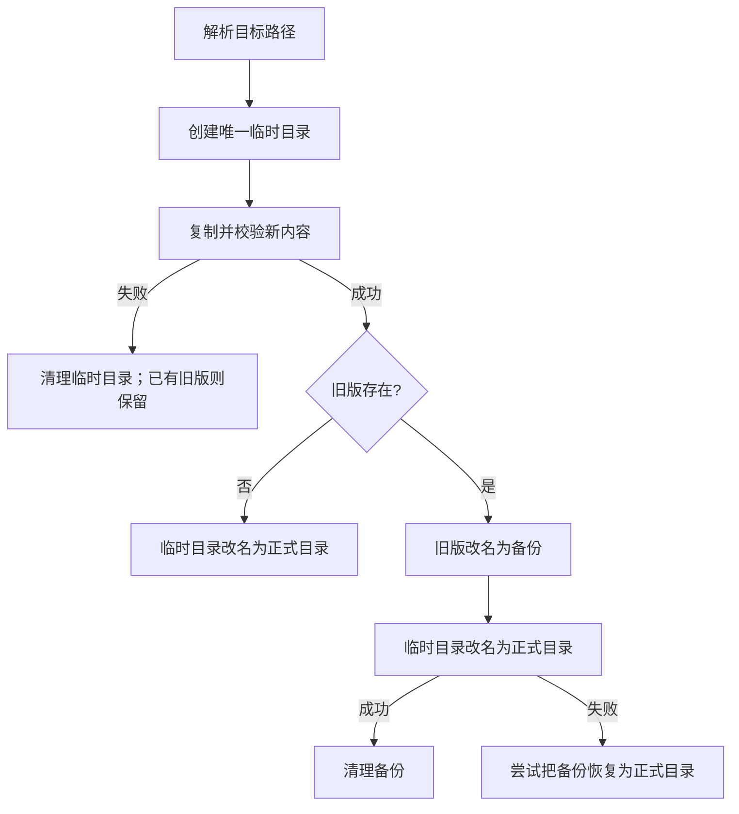
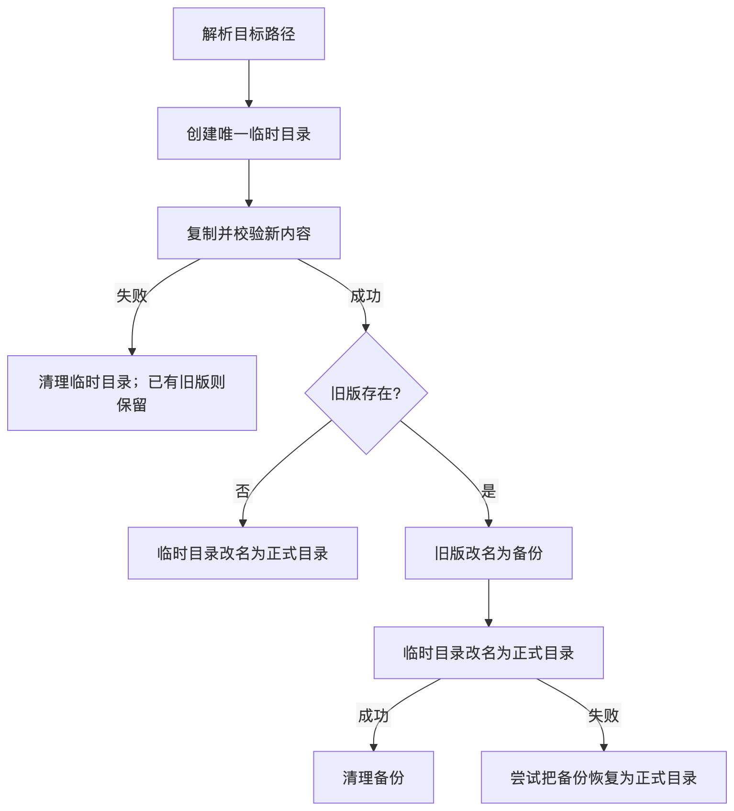
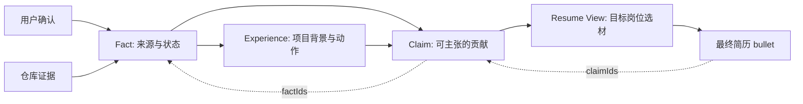
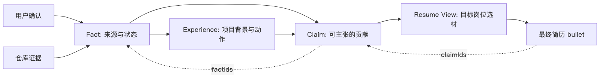

# 后端开发工程师｜简历面试问题预设

这份文档围绕 `fish-skill` 简历中的项目描述，用候选人现场回答的口吻展开。每题先回答问题，再说明关键机制、例子与边界。以下是练习用参考稿：已实现的项目事实与尚未实现的设计建议必须分清，面试时请用自己的理解复述。

# 一、Node.js CLI：安装行为与失败边界

## 你说独立开发了 `list / check / install` CLI，三个命令分别做什么，安装路径如何确定？

`list`、`check`、`install` 分别负责 Skill 的发现、基础校验和安装。

`list` 会扫描包里的 `skills` 目录，把存在 `SKILL.md` 的直接子目录识别成一个 Skill；`check` 目前做的是比较轻量的入口检查，比如确认 `SKILL.md` 是否以 frontmatter 的 `---` 开头；`install` 则负责把指定 Skill 递归复制到用户项目的目标目录。

这里我特意区分了两个路径基准。

**源路径不能基于 `process.cwd()`**，因为 CLI 可能在任何目录执行，所以我是通过：

```text
import.meta.url
→ fileURLToPath
→ dirname
→ packageRoot
→ skills
```

找到 npm 包自身的资源。

而目标路径是用户项目里的位置，所以用：

```ts
path.resolve(process.cwd(), target)
```

解析。

比如包在 `/opt/fish-skill`，用户在 `/home/me/project` 执行：

```bash
fish-skill install resume-copilot --target .agents/skills
```

那么源是：

```text
/opt/fish-skill/skills/resume-copilot
```

目标是：

```text
/home/me/project/.agents/skills/resume-copilot
```

需要说明的是，我现在的 `check` 只是**基础入口校验**，不是完整 Schema 校验，更不会验证所有引用文件一定存在。

## 已有目录时为什么要求 `--force`？它能保证安装安全吗？

`--force` 本质上解决的是**用户意图确认**，不是事务安全。

默认情况下，如果目标目录已经存在，我会直接拒绝安装，避免误覆盖用户原来的 Skill。只有用户显式传入 `--force`，才说明他确实接受覆盖。

但当前实现是：

```text
删除旧目录
→ 复制新目录
```

所以它只能保证：

> 不会在用户不知道的情况下覆盖。

不能保证：

> 覆盖过程中失败时旧版本还能恢复。

比如旧版本删除以后，复制到一半磁盘满了，那么最后可能既没有完整旧版本，也没有完整新版本。

所以我在面试里会把 `--force` 定义为：

**覆盖保护机制，而不是原子安装机制。**

## 如果要避免覆盖中途把旧版删掉，你会怎样改安装流程？

我会改成一个**prepare → switch → cleanup** 的流程。

大概是：

```text
1. 创建唯一临时目录
2. 把新版完整复制进去
3. 对临时目录做校验
4. 如果存在旧版，把旧版 rename 成 backup
5. 把临时目录 rename 成正式目录
6. 成功后删除 backup
7. 如果切换失败，尝试把 backup 恢复回来
```

核心思想是：

> 在新版没有准备完整之前，不碰旧版本。

临时目录最好跟正式目标在**同一个文件系统**，这样 rename 才能利用同文件系统内比较强的原子可见性。

不过我不会说整个过程完全原子。

因为：

```text
old → backup
temp → target
```

仍然是两个文件系统操作。

所以进一步还需要做**崩溃恢复协议**。这套 prepare → switch → cleanup 方案是我会采取的改造方向，当前 CLI 尚未实现。

比如程序下次启动时看到：

```text
target 不存在
backup 存在
temp 存在
```

就能判断大概率停在旧版已经备份、新版还没切换的阶段，这时应该优先恢复 backup，而不是直接清理。

所以真正重要的不是“用了临时目录”，而是：

**每一个中间状态都必须是可识别、可恢复的。**

### 安装状态图





## 两个进程同时安装到同一目标目录时，为什么仅靠临时目录还不够？

因为临时目录只能解决**准备阶段互相覆盖文件**的问题，解决不了**最终谁提交**的问题。

比如 A、B 同时从 V0 开始：

```text
A 准备 VA
B 准备 VB
```

两个人都有独立 temp，所以准备阶段没问题。

但提交阶段可能发生：

```text
A: V0 → backup
B: 发现 target 不存在
A: VA → target
B: 又准备提交 VB
```

这时 B 甚至可能把 A 刚提交的版本当成旧版本处理。

所以这里本质上是一个：

> check 和 commit 之间的竞态条件。

如果真的要支持并发安装，我会加**目标路径级的互斥锁**。

锁住的不是复制阶段，而是：

```text
重新检查目标状态
→ 备份
→ 切换
→ 确认提交
```

这整个临界区。

另外也可以增加 version/hash 做乐观并发控制：

> 我准备新版时看到的是 V0，提交之前重新检查，如果目标已经不是 V0，就终止或重试。

不过单纯：

```text
读 hash
→ 判断
→ 提交
```

本身也存在竞态，所以版本校验最终还是需要 CAS 类原子条件或者锁来完成。

当前这个 CLI 没实现这些，因此我只会说它有**显式覆盖保护**，不会说它支持并发安全安装。

# 二、事实建模：Fact → Experience → Claim → Resume View

## 为什么要分 `Fact → Experience → Claim → Resume View` 这几层？

因为我想解决的是：

> 一句最终出现在简历上的话，能不能一路追溯到它为什么可以这么写。

这四层承担的职责不同。

**Fact** 是原始事实，比如：

```text
仓库里确实实现了 install CLI
用户确认这个项目由本人独立完成
```

**Experience** 是项目级上下文：

```text
这个项目为什么做
做了什么
结果是什么
```

**Claim** 是真正可以对外主张的内容：

```text
独立开发 Node.js CLI
```

而 **Resume View** 是岗位视角下的选材：

```text
后端岗展示哪些 Claim
Agent 岗展示哪些 Claim
前端岗又展示哪些 Claim
```

它本身不创造事实。

最重要的一点是：

```text
Resume bullet
→ claimIds
→ Claim
→ factIds
→ Fact
```

所以最终一句话如果被质疑，我可以反向回答：

> 这句话依赖哪些事实，以及哪些事实只能证明项目存在、哪些事实才能证明是我本人做的。

这样生成模型就不是“看到资料之后自由发挥”，而是在一个有证据边界的数据模型上做表达。

### 事实追溯图





## JSON Schema 能保证这些数据可信、引用完整吗？

不能。

我会把它分成三层。

### 第一层：结构正确

Schema 比较擅长，比如：

```json
{
  "claimIds": ["claim-cli"]
}
```

它可以要求：

```text
claimIds 必须存在
必须是数组
数组元素必须是 string
至少有一个元素
```

### 第二层：引用正确

Schema 一般不能直接保证：

```text
claim-cli
```

一定存在于另外一个 Claims 集合。

这个需要业务代码做跨对象校验。

### 第三层：事实可信

即使：

```text
bullet → Claim → Fact
```

整个引用都存在，也不代表事实本身是真的。

比如仓库代码只能证明：

> 项目存在 install 功能。

却不能证明：

> 这个功能由我独立完成。

后者需要用户确认、提交记录等 ownership 证据。

所以我会说：

> Schema 解决数据形状，引用校验解决关系完整性，证据体系解决陈述可信度。

这三个不能混在一起。

## 怎么验证一条 Resume bullet 到原始事实的引用链？

我会先给所有实体建立索引：

```ts
factMap
claimMap
metricMap
experienceMap
```

例如：

```ts
new Map(items.map(item => [item.id, item]))
```

然后从 View 开始遍历：

```text
bullet
↓
claimIds
↓
Claim
↓
factIds / metricIds / experienceId
↓
Fact / Metric / Experience
```

每一条边都检查两件事。

第一：

> 引用对象是否存在。

第二：

> 这个引用关系是否合法。

比如一个 Claim 引用了一个 Metric，但这个 Metric 属于另外一个 Experience，即使 ID 存在，也应该报错。

同时构建 Map 前还要检查：

```text
是否存在重复 ID
```

不然：

```ts
map.set(id, object)
```

可能悄悄把前一个对象覆盖掉。

错误信息最好不要只返回：

```text
validation failed
```

而应该返回：

```text
sections[0]
.entries[0]
.bullets[2]
.claimIds[0]

missing claim: claim-x
```

这样才能真正维护这套数据。

## 仓库证明功能存在，为什么不能直接写“我设计并实现”？

因为这两个 Claim 的**主语不同**。

仓库只能比较强地证明：

> 这个项目存在某个能力。

比如代码里确实存在 CLI。

但简历写的是：

> 我设计并实现了 CLI。

这又增加了：

```text
ownership
```

也就是“谁做的”。

所以我会把：

```text
Capability evidence
```

和：

```text
Ownership evidence
```

分开。

例如只有代码：

```text
Fact A：
项目存在 install 命令
```

最多比较安全地生成：

> 项目提供 Skill 安装能力。

如果再增加：

```text
Fact B：
用户确认整个项目由本人独立完成
```

才可以把 Claim 提升成：

> 独立开发 Skill 安装 CLI。

所以不是“代码证据更强了”，而是：

**新增了一类 ownership 证据。**

这也是为什么我不会因为看到 GitHub 仓库里有一个功能，就自动在简历里写成“主导设计”。

# 三、Resume View → HTML

## `Resume View → HTML` 具体经过哪些步骤？

整体上我把它分成**构建时**和**浏览器运行时**。

构建时 Node.js 脚本读取：

```text
Resume View JSON
共享 CSS
版式 CSS
主题配置
浏览器端 renderer
```

然后把它们组合成 HTML。

单文件模式会把 CSS、JS、数据都内联进去，所以用户可以直接打开。

浏览器打开后，再由 renderer：

```text
读取 window.KAMI_RESUME_DATA
↓
生成 header
↓
生成 skills
↓
生成 experience/project bullets
↓
写入 #kami-root
```

主题本身主要通过 CSS Variable 控制，比如：

```css
:root {
  --brand: #1b365d;
}
```

所以数据层本身不需要知道具体配色。

需要特别说明的是：

> 这是静态 HTML generator + 浏览器渲染，不是已经部署的后端服务。

## 为什么 `JSON.stringify` 后嵌入 `<script>` 还要处理 `</script>`？

因为这里存在**两个解析器**。

第一层是：

```text
HTML parser
```

第二层才是：

```text
JavaScript parser
```

假设用户输入：

```html
</script><script>alert(1)</script>
```

即使经过：

```js
JSON.stringify()
```

JavaScript 语法本身可能没有问题。

但浏览器首先在解析 HTML。

HTML parser 看到：

```html
</script>
```

就会认为当前 `<script>` 已经结束。

它根本不会等 JavaScript parser 来告诉它：

> 这个 `</script>` 其实在字符串里面。

所以要把：

```text
</
```

改造成类似：

```text
<\/
```

这样 HTML parser 看不到字面意义上的关闭标签。

等 JavaScript 真正执行时，`\/` 又会被解释回 `/`。

所以这个处理防的是：

> HTML 解析器提前终止 `<script>`。

而不是 `JSON.stringify` 做得不够好。

## 为什么文本转义和链接安全不能共用一个判断？

因为它们属于不同的**输出上下文**。

例如：

```html
<div>${text}</div>
```

主要防的是：

```html

```

被当成 HTML。

所以需要把：

```text
&
<
>
"
'
```

做 HTML escaping。

但链接：

```html
<a href="${url}">
```

即使已经把双引号转义了：

```text
javascript:alert(1)
```

仍然可能是一个合法属性值。

问题不在于它逃出了 `href=""`，而在于浏览器会把它解释成一个危险 URL scheme。

所以链接安全需要两层：

```text
URL 语义校验
+
HTML 属性编码
```

例如：

```ts
const url = new URL(input)
```

然后只允许：

```text
https:
http:
```

否则不生成 `<a>`，直接降级成普通文本。

这是改进方案；当前渲染器有文本和属性转义，但尚未完整实现 URL 协议白名单。

因此：

> HTML escape 解决“能不能注入结构”，URL allowlist 解决“这个链接语义本身安不安全”。

这两个不能混成一个 `escape()`。

## 五套主题只换 CSS Variable，怎么确认真的生效？

不能只检查：

```text
HTML 文件里出现了 #b0362a
```

因为颜色字符串存在，不代表 CSS 规则有效。

比如：

```css
--brand: #b0362a;
```

如果它直接裸写在 `<style>` 里，而不是：

```css
:root {
  --brand: #b0362a;
}
```

浏览器可能直接忽略。

所以真正的验证应该进入浏览器，读取：

```js
getComputedStyle(document.documentElement)
  .getPropertyValue('--brand')
```

然后对五个页面分别跟**预先写死的 expected value** 比较。

最好进一步检查实际使用这个变量的元素：

```js
getComputedStyle(titleElement).color
```

因为：

```text
CSS variable 正确
```

到：

```text
真实元素正确使用 variable
```

中间仍然可能存在样式覆盖。

另外 PDF/打印又是另一层。

屏幕里 computed style 正确，不代表 `@media print` 下也正确，所以打印交付还应该单独检查分页、字体、背景色。

# 四、78 项自动化检查

## “78 项确定性检查通过”究竟证明了什么？

我会非常克制地描述：

> 它说明当前版本仓库中定义的 78 项确定性断言全部通过。

主要覆盖：

```text
Skill 文件结构
JSON Schema 正反例
跨对象引用完整性
CLI 行为
Kami renderer 行为
主题/规格一致性
简历内容基础 lint
```

例如：

```text
install 没有 --force 时拒绝覆盖
```

可以算一个检查。

```text
bullet 的 claimIds 全部存在
```

也可以算一个检查。

但这两个检查的风险权重明显不一样。

所以 `78` 不是：

```text
78 个业务场景
78% coverage
78% 稳定性
```

更不是生产环境指标。

它只是：

> 当前测试集合里登记的 78 个 assertion 都满足。

新增或拆分一项测试，这个数字都会变化。

## 78 项全绿，为什么仍然可能有用户可见错误？

因为测试结果永远取决于三件事：

```text
测了什么输入
观察了什么结果
用什么 oracle 判断对错
```

最典型的例子就是主题颜色。

如果测试只是：

```js
html.includes('--brand')
```

那么哪怕 CSS 写成：

```css
--brand: red;
```

没有任何 selector，测试也会 PASS。

但是用户打开浏览器看到的颜色依然可能错。

这就是：

> 测试观察点停在了生成文件，而用户真正看到的是浏览器计算结果。

所以测试数量并不能弥补**测试层级选错**。

正确的测试应该进入浏览器：

```text
HTML generator
↓
HTML parser
↓
CSS parser
↓
Cascade
↓
computed style
```

然后再做断言。

## 怎样避免测试把实现里的错误假设又写一遍？

核心原则是：

> 不测试“代码是不是按照我的实现写了”，而测试“外部契约是不是成立”。

例如 CLI 的业务契约是：

> 没有 `--force` 时旧目录不能受到修改。

如果要把这条契约测完整，测试应该：

```text
1. 创建旧目录
2. 写一个 sentinel.txt
3. 记录文件内容
4. 执行 install
5. 检查命令失败
6. 再比较 sentinel.txt 字节内容
```

而不是去检查源码里：

```text
有没有字符串 "--force"
```

主题也是一样。

契约是：

> 不同主题用户实际看到不同颜色。

所以测试：

```text
computed style
```

而不是：

```text
HTML 是否包含 hex string
```

另一个很好用的方法是**mutation test 思路**。

做测试校准时，可以故意删除：

```css
:root
```

如果测试还全部通过，就说明测试没有真正守住这个行为。

再比如故意把：

```text
claim-cli
```

改成：

```text
claim-not-exist
```

引用检查必须变红。

也就是：

```text
故意破坏
→ 测试变红
→ 恢复
→ 测试重新变绿
```

这样才能确认测试不是“陪跑型测试”。

## 做一轮端到端验证，你会选什么最短关键路径？

我会选择：

```text
合法 Resume View
↓
Node.js generator
↓
生成 5 个 HTML
↓
真实浏览器加载
↓
DOM / CSS / 内容校验
↓
打印预览
```

具体我会准备一个非常小的 fixture，例如：

```text
2 条技能
1 个项目
1 条 bullet
1 个链接
```

然后验证：

第一，五个 HTML 都能成功打开，并且渲染的是**同一份业务内容**。

第二，每个主题读取：

```js
getComputedStyle(...).getPropertyValue('--brand')
```

确认是预先定义好的五组值。

第三，再准备一个恶意输入：

```html
</script>
```

验证：

```text
script 不会提前终止
DOM 不会产生 img
内容仍作为普通文本显示
```

第四，再测试 URL：

```text
https://github.com/xxx
```

应该正常。

```text
javascript:alert(1)
```

当前实现尚无完整的协议 allowlist，因此这个测试应该暴露为**已知风险**，而不是为了让测试绿去修改预期。

最后才进入打印预览：

```text
A4 分页
字体
背景色
项目是否被错误拆页
文本是否可以搜索/选择
```

这样已经覆盖了：

```text
数据
→ 构建
→ HTML parser
→ JavaScript
→ CSS
→ DOM
→ 用户最终看到的页面
```

而且这条链路比较短，不需要一开始就堆大量场景。

# 五、岗位定位

## 这个项目到底体现了什么后端能力？

我反而会主动把边界说清楚：

这个项目目前最能体现的不是传统的“高并发后端服务”，而是三类工程能力。

**第一类是 Node.js 工具工程。**

包括 CLI、文件系统操作、安装边界、路径解析、失败处理。

**第二类是数据契约与一致性。**


包括：

```text
JSON Schema
跨对象引用
ID 索引
事实追溯
业务不变量
```

本质上已经有一些类似数据库数据完整性约束的思想。

**第三类是可靠性和测试思维。**

比如我会主动区分：

```text
--force ≠ 原子更新
临时目录 ≠ 并发控制
Schema 正确 ≠ 引用正确 ≠ 事实可信
字符串测试通过 ≠ 浏览器结果正确
```

这些思维是可以迁移到服务端工程的。

但如果面试官问我：

> 这个项目有没有 QPS、数据库事务、分布式锁、消息队列、线上故障恢复？

如果真实项目没做，我不会强行往上靠。

我会回答：

> 当前项目没有这类线上服务端场景，但像安装提交的并发控制，其实已经能抽象出和服务端类似的问题：临界区、互斥、版本校验、提交、崩溃恢复。如果它进一步演进成多人共享的服务，我会把这些本地文件系统问题映射到数据库事务、CAS、分布式锁和持久化状态机上。

这会比“为了后端岗把一个 CLI 项目硬讲成分布式系统”可信得多。
