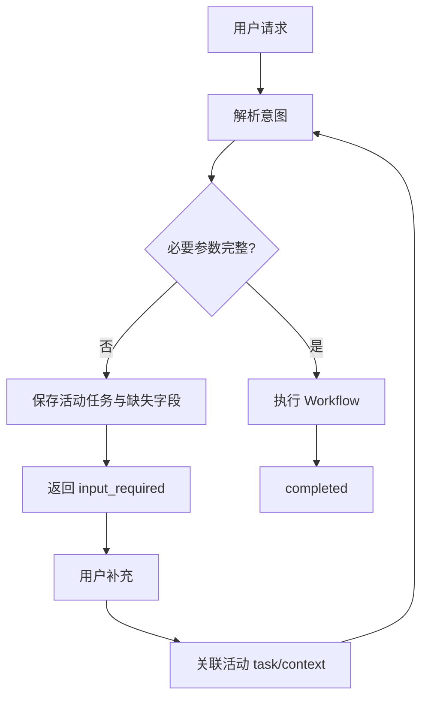

# Interview Knowledge Expansion Examples

本文件用于帮助 Coding Agent 理解“什么值得继续追问”，不是用户可见输出模板。

## 示例 1：低代码平台

### Resume Claim

```text
设计并实现低代码事件驱动机制，将组件事件、触发条件与动作配置统一抽象至 Schema，通过事件解析与运行时执行链路支撑组件间交互。
```

### Root Answer 中的候选节点

```text
Schema
事件解析
运行时执行
JSON
组件
```

### 判定

#### Schema → EXPAND

- Role Relevance：高
- Claim Dependency：高
- Discriminative Power：高
- Information Gain：高

问题：

```text
Schema 在事件驱动系统里具体描述哪些信息？为什么要把事件和动作配置抽象进 Schema？
```

#### JSON → DROP

如果 JSON 只是存储 Schema 的格式，则“JSON 是什么”无法显著帮助判断低代码平台能力。

#### 运行时执行 → EXPAND

问题：

```text
配置在运行时是如何被解析并转化为真正的组件交互行为的？
```

这个问题可以区分“只会配置 Schema”和“理解运行时机制”。

---

## 示例 2：Agent Workflow

### Resume Claim

```text
基于 LangGraph 构建 Supervisor + Specialist 的多 Agent Workflow。
```

Root Answer：

```text
Supervisor 根据任务状态决定下一步节点，Specialist 的结果写入共享状态，最终由 Supervisor 汇总。
```

候选：

- Supervisor
- 任务状态
- 共享状态
- 节点
- 汇总

不要机械问：

```text
什么是节点？
什么是状态？
```

优先问：

```text
Supervisor 根据什么信息做路由决策？

多个 Specialist 都会修改共享状态时，状态是如何合并的？

为什么这里需要 Supervisor，而不是让多个 Agent 互相直接调用？
```

原因：这些问题能显著增加对 Multi-Agent 设计能力的判断。

---

## 示例 3：前端性能

### Resume Claim

```text
通过精简 Redux 状态订阅降低 React 页面交互阶段的长任务。
```

候选：

- Redux
- mapStateToProps
- 状态订阅
- JavaScript
- 长任务

不要因为 Redux / JavaScript 是前端关键词就自动追基础定义。

优先：

```text
为什么订阅过大的状态范围会导致无关组件重复计算或渲染？

你是如何证明交互长任务与状态订阅有关，而不是网络或图片加载导致？
```

这些问题同时具备 Claim Dependency 和高区分度。

---

## 示例 4：产品经理

### Resume Claim

```text
通过 AB 实验验证新的转化路径并推动方案上线。
```

Root Answer 可能提到：

- 实验组 / 对照组
- 转化率
- 显著性
- 埋点 SDK

如果 Target Role 是产品经理：

高价值：

```text
为什么选择转化率作为主指标？有没有 guardrail metric？

如果主指标提升但退款率也提高，怎么判断实验是否成功？
```

低价值：

```text
埋点 SDK 内部如何批量上报 HTTP 请求？
```

除非 JD 本身要求数据平台 / 技术产品能力，否则后者通常不会改变产品岗位判断。

---

## 示例 5：详细答案与流程图

问题：

```text
多轮澄清的 Agent 如何在用户补充信息后继续原任务？
```

推荐答案结构：

1. 先说明核心思想：保存未完成任务状态，而不是把澄清当成新请求。
2. 描述需要保存的数据：task id、当前意图、缺失字段、上下文。
3. 描述下一轮如何识别与旧任务的关系。
4. 用流程图展示状态流转。
5. 再结合项目中的 A2A `input_required` 场景。

示例图：

以下是生成前的 Mermaid 源码。保存为 Markdown 后运行
`node scripts/embed-mermaid.mjs <文档.md>`，交付稿会在围栏后插入 PNG 图片引用。



不推荐只回答：

```text
通过保存上下文，在用户补充后继续任务。
```

因为它没有说明“保存什么、怎么关联、什么时候继续”。


---

## 示例 6：Answer-first 与待展开队列

Resume Claim：

```text
使用 Transactional Outbox 保证长任务事件可靠记录与异步投递。
```

### 第 1 层

问题：

```text
为什么业务状态和 Outbox Event 要在同一个事务里提交？
```

回答中出现：

```text
本地事务、至少一次投递、重复投递、幂等、JSON
```

价值判断：

- `重复投递 / 幂等` → `UNEXPANDED`，因为它直接影响可靠性 Claim 的正确性
- `JSON` → `DROPPED`，因为它只是表示格式，不增加岗位判断信息

此时不能直接横向跳到“为什么不用 Kafka”。应先消费 `幂等` 这个高价值未展开节点。

### 第 2 层

问题：

```text
Outbox Worker 重复投递时，消费侧如何保证幂等？
```

回答中出现：

```text
eventId、唯一约束、条件更新、check-then-act 竞态
```

新节点：

```text
并发消费下的原子去重 → UNEXPANDED
```

于是继续：

```text
为什么“先查再写”在两个 Worker 并发时仍然可能重复执行？
```

这体现的是：

```text
Answer₀
→ Node₁
→ Question₁
→ Answer₁
→ Node₂
→ Question₂
```

而不是：

```text
Claim
→ 一次性列 10 个相关问题
```

### Answer Exhaustion Check

只有当当前 Claim 中所有高价值节点都变成：

- `EXPANDED`
- `MERGED`
- `DROPPED`

且不再存在 `UNEXPANDED` 节点时，才允许转到其他 sibling 问题或下一个 Claim。


---

## 示例 7：Expansion Queue 必须抢占 Root Queue

Resume Claim：

```text
使用 Transactional Outbox + Worker 实现 Webhook 可靠投递。
```

初始 Root Queue 可能识别出：

```text
ROOT_PENDING: 为什么用 Outbox？
ROOT_PENDING: 为什么不用直接发 HTTP？
ROOT_PENDING: 如何做 Webhook 签名？
ROOT_PENDING: 如何处理死信？
```

**不要一次性把这四道题全部生成出来。**

先只物化最有价值的 Root Question：

```text
为什么用 Transactional Outbox？
```

Answer 中出现：

```text
FOR UPDATE SKIP LOCKED
至少一次投递
重复投递
幂等
```

高价值判定后：

```text
Expansion Queue:
- 幂等处理                UNEXPANDED
- 多 Worker 并发领取       UNEXPANDED

Root Queue:
- 为什么不用直接发 HTTP？ ROOT_PENDING
- 如何做 Webhook 签名？   ROOT_PENDING
- 如何处理死信？          ROOT_PENDING
```

此时调度顺序必须是：

```text
幂等处理 / 多 Worker 并发领取
>
Webhook 签名 / 死信等 Root Question
```

因此下一题应来自 Expansion Queue，例如：

```text
多个 Worker 同时扫描 Outbox 时，FOR UPDATE SKIP LOCKED 如何避免同一条记录被重复领取？
```

这个 Answer 又可能产生：

```text
事务锁
Worker crash
回滚
饥饿 / starvation
```

继续完成 Node Extraction 和价值判断。只要仍有 HIGH-VALUE `UNEXPANDED` 节点，Sibling Transition Gate 必须保持 `BLOCKED`。

只有 Expansion Queue 真正清空，才允许回到 Root Queue 继续“Webhook 签名”等横向主题。

这个示例体现：

```text
Answer-driven vertical expansion
>
preplanned topic coverage
```


---

## 示例 8：不要在当前分支尚未耗尽时横跳

目标方向：Agent 应用开发 / Agent 平台工程。

当前问题：

```text
既然 Specialist 彼此独立，为什么不直接并行跑？
```

Generated Answer 已经解释：

```text
并行会增加瞬时并发、上游限流压力、取消传播与部分失败处理复杂度；
可以按依赖图分层并行，并设置每层并发上限、超时和部分结果标识。
```

这时 Candidate Nodes 至少包括：

```text
部分失败如何收敛
并发上限如何设计
取消如何跨并行分支传播
依赖分层如何决定
```

如果其中某个节点仍具备高 Role Relevance、Claim Dependency 和 Information Gain，应继续当前分支，例如：

```text
并行执行时，如果一个 Specialist 失败，其他节点已经成功，Supervisor 应该整体失败还是带部分结果继续？
```

此时不应因为 Root Queue 里还有：

```text
checkpoint 与业务 Task 有什么区别
```

就立刻横跳到 checkpoint。

只有当前 Answer 的高价值后代已经：

- `EXPANDED`
- `COVERED`
- `MERGED`
- `DROPPED`

且没有值得继续的 `UNEXPANDED` 后代时，才允许回到 Root Queue。

### 已经解释充分的节点不要重复追

如果 Answer 已经完整说明：

```text
Worker 崩溃后数据库行锁随事务回滚释放；若应用还维护 processing/lease 状态，则需要超时回收僵死租约。
```

不要仅因为答案出现了 `Worker crash / lease` 就机械再问：

```text
Worker 崩溃怎么办？
```

先判断 Coverage：

```text
Worker crash recovery → SUFFICIENT → COVERED
```

只有进一步追问能增加新的岗位判断信息，例如租约续期与误回收竞态，才创建更具体的新节点。


## 示例 9：一个 Answer 可以保留多个 sibling 问题

假设 Outbox 的 Answer 同时说明：

- Worker 使用 `FOR UPDATE SKIP LOCKED` 领取记录
- 投递失败会 retry / backoff
- 语义是 at-least-once
- 消费侧必须幂等

Node Extraction 不应该只留下“幂等”一个节点，而应该得到：

```text
sourceAnswerId = a-outbox

├── 幂等 / 原子去重                  UNEXPANDED
├── 多 Worker / SKIP LOCKED          UNEXPANDED
└── retry / backoff / dead letter    UNEXPANDED
```

下一步调度器可以先选择“幂等”继续：

```text
消费侧怎么保证重复事件不会重复执行？
```

但此时另外两个 sibling **不能消失**。如果“幂等”分支继续产生 `unique constraint → check-then-act → transaction`，先完成该高价值深分支；当它耗尽后，回到：

```text
多 Worker / SKIP LOCKED
retry / backoff / dead letter
```

继续生成对应问题。

错误行为：

```text
从 Answer 提取 3 个高价值节点
→ 只留下最高价值的 1 个
→ 另外 2 个直接丢失
```

正确行为：

```text
从 Answer 提取 3 个高价值节点
→ 3 个全部保留为 UNEXPANDED
→ 一次执行 1 个
→ 当前分支耗尽后返回其余 sibling
```
