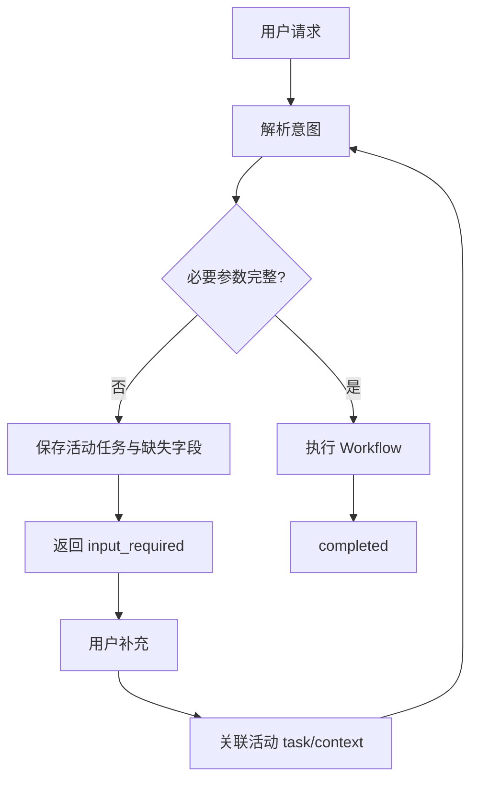

# Interview Knowledge Expansion Examples

本文件用于帮助 Coding Agent 理解“什么值得继续追问”，不是用户可见输出模板。

## 示例 1：低代码平台

### Resume Claim

```text
设计并实现低代码事件驱动机制，将组件事件、触发条件与动作配置统一抽象至 Schema，通过事件解析与运行时执行链路支撑组件间交互。
```

### Root Answer 中的候选节点

```text
Schema
事件解析
运行时执行
JSON
组件
```

### 判定

#### Schema → EXPAND

- Role Relevance：高
- Claim Dependency：高
- Discriminative Power：高
- Information Gain：高

问题：

```text
Schema 在事件驱动系统里具体描述哪些信息？为什么要把事件和动作配置抽象进 Schema？
```

#### JSON → DROP

如果 JSON 只是存储 Schema 的格式，则“JSON 是什么”无法显著帮助判断低代码平台能力。

#### 运行时执行 → EXPAND

问题：

```text
配置在运行时是如何被解析并转化为真正的组件交互行为的？
```

这个问题可以区分“只会配置 Schema”和“理解运行时机制”。

---

## 示例 2：Agent Workflow

### Resume Claim

```text
基于 LangGraph 构建 Supervisor + Specialist 的多 Agent Workflow。
```

Root Answer：

```text
Supervisor 根据任务状态决定下一步节点，Specialist 的结果写入共享状态，最终由 Supervisor 汇总。
```

候选：

- Supervisor
- 任务状态
- 共享状态
- 节点
- 汇总

不要机械问：

```text
什么是节点？
什么是状态？
```

优先问：

```text
Supervisor 根据什么信息做路由决策？

多个 Specialist 都会修改共享状态时，状态是如何合并的？

为什么这里需要 Supervisor，而不是让多个 Agent 互相直接调用？
```

原因：这些问题能显著增加对 Multi-Agent 设计能力的判断。

---

## 示例 3：前端性能

### Resume Claim

```text
通过精简 Redux 状态订阅降低 React 页面交互阶段的长任务。
```

候选：

- Redux
- mapStateToProps
- 状态订阅
- JavaScript
- 长任务

不要因为 Redux / JavaScript 是前端关键词就自动追基础定义。

优先：

```text
为什么订阅过大的状态范围会导致无关组件重复计算或渲染？

你是如何证明交互长任务与状态订阅有关，而不是网络或图片加载导致？
```

这些问题同时具备 Claim Dependency 和高区分度。

---

## 示例 4：产品经理

### Resume Claim

```text
通过 AB 实验验证新的转化路径并推动方案上线。
```

Root Answer 可能提到：

- 实验组 / 对照组
- 转化率
- 显著性
- 埋点 SDK

如果 Target Role 是产品经理：

高价值：

```text
为什么选择转化率作为主指标？有没有 guardrail metric？

如果主指标提升但退款率也提高，怎么判断实验是否成功？
```

低价值：

```text
埋点 SDK 内部如何批量上报 HTTP 请求？
```

除非 JD 本身要求数据平台 / 技术产品能力，否则后者通常不会改变产品岗位判断。

---

## 示例 5：详细答案与流程图

问题：

```text
多轮澄清的 Agent 如何在用户补充信息后继续原任务？
```

推荐答案结构：

1. 先说明核心思想：保存未完成任务状态，而不是把澄清当成新请求。
2. 描述需要保存的数据：task id、当前意图、缺失字段、上下文。
3. 描述下一轮如何识别与旧任务的关系。
4. 用流程图展示状态流转。
5. 再结合项目中的 A2A `input_required` 场景。

示例图：



不推荐只回答：

```text
通过保存上下文，在用户补充后继续任务。
```

因为它没有说明“保存什么、怎么关联、什么时候继续”。
