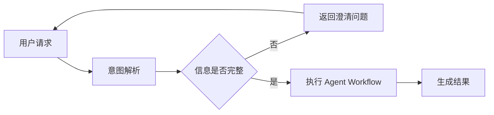

# Interview Knowledge Workflow

## 目标

Interview Knowledge 是默认面试准备模式。它不要求用户先回答问题，而是围绕 Resume View 中暴露的 Claim 自动生成：

- 面试问题
- 参考答案
- 参考答案中新的可追问知识节点
- 下一层追问与回答
- 最终形成 Interview Knowledge Tree / Graph

核心链路：

```text
Resume Claim
   ↓
Root Question
   ↓
Generated Reference Answer
   ↓
Extract Drillable Knowledge Nodes
   ↓
Normalize / Deduplicate / Prioritize
   ↓
Generate Follow-up Question
   ↓
Generate Follow-up Answer
   ↺
```

默认模式下，**不得因为答案是系统生成的，就推断用户已经掌握这些内容**。

## 输入

优先读取：

- Resume View 中实际暴露的 `claimIds`
- Claim 对应的 Experience / Metric / Ownership / Evidence
- Target Role / JD Requirement
- 已存在的 Interview Knowledge Graph

不要重新从最终简历文案猜事实；简历文本只用于确定“用户最终暴露了什么”。

## Root Question 生成

每个核心 Claim 可以按需覆盖以下问题维度：

1. `DEFINITION`：是什么
2. `MOTIVATION`：为什么需要
3. `IMPLEMENTATION`：怎么做
4. `MECHANISM`：底层为什么成立
5. `FAILURE`：异常、失败、恢复
6. `CONSISTENCY`：一致性、顺序、幂等
7. `CONCURRENCY`：并发、竞态、锁
8. `PERFORMANCE`：吞吐、延迟、复杂度、指标
9. `TRADEOFF`：为什么选 A，不选 B
10. `SCALING`：规模扩大后怎么办
11. `METRIC`：指标怎么计算、来源是什么
12. `OWNERSHIP`：这个能力在项目中自己做到哪一层

不是每个 Claim 都机械生成全部维度。根据 Claim Strength、Target Role、JD 相关性决定覆盖范围。

## Generated Reference Answer

参考答案的首要目标是**准确回答面试问题本身**。项目事实用于场景化答案，而不是决定“这个问题能不能回答”。

答案生成按以下顺序：

1. **Canonical Answer**：先用可靠的通用技术知识完整回答问题，覆盖原理、实现、边界和取舍中与题目相关的部分。
2. **Project Context**：如果 Career Profile / Repository 能确认项目中的具体使用方式，把这些背景自然融入答案，说明“在这个项目里是怎么落地的”。
3. **Project-specific Gap**：如果仓库只能证明存在某个机制，但无法证明选择动机、故障恢复、性能效果等项目细节，仍然输出完整准确的 Canonical Answer；只对无法确认的项目个性化部分做简短旁白提醒。

必须遵守：

- 不得因为项目证据不足，就把技术答案降级成“无法确认”。
- 不得把通用最佳实践写成“用户项目就是这样做的”。
- 不得静默提高 Ownership。
- 不得编造用户没有确认的项目指标、线上事故、选型动机或实际运行效果。
- 对纯概念 / 原理问题，如果答案不依赖项目事实，可以直接回答，不需要任何旁白。

内部仍可记录 `groundingStatus`，但它表示的是**项目场景化程度**，不是答案本身的正确性或完整性。

例如：

```markdown
## Worker 重复投递时如何保证幂等？

幂等的核心是让同一个业务事件重复执行多次时，只产生一次有效业务结果。常见做法是给事件分配稳定的 eventId，并在消费侧通过唯一约束、幂等记录表或业务唯一键执行原子去重……

> 旁白：当前项目可以确认存在 Outbox / Worker 链路，但消费侧具体采用哪一种幂等实现尚未核实；面试时需要按你的真实实现补充。
```

## Answer Detail Standard

Interview Knowledge 的参考答案默认应当达到“用户可以直接拿来学习和复习”的详细程度，而不是只给一两句话的摘要。

根据问题复杂度按需使用：

- 分层解释：先结论，再原理，再结合项目场景
- 步骤列表：适合流程、实现、排查、设计题
- 对比表格：适合方案选择、协议 / 框架区别、tradeoff
- ASCII / Mermaid 流程图：适合链路、状态流转、Agent 编排、数据流、时序关系
- 伪代码 / 示例结构：适合接口、状态机、数据结构、算法机制
- 具体例子：帮助把抽象机制落到可理解场景

如果一个流程图可以显著降低理解成本，应优先绘制流程图，不要只用一段文字描述。

例如：



回答长度由问题复杂度决定，不为了简短而省略关键因果链、边界和步骤。

但也不要为了“详细”做百科式扩写：所有补充内容仍应服务当前问题与目标岗位。

## Answer-driven Knowledge Expansion

系统生成参考答案后，不是简单“抽取所有技术关键词”，而是先产生 Candidate Knowledge Node，再按 `policies/knowledge-expansion-policy.md` 判断哪些节点值得继续展开。

候选节点可以来自：

- 答案中显式出现的关键概念或机制
- 当前机制隐含但没有直接写出的必要工程问题
- 技术选择自然引出的替代方案 / 取舍
- 正常路径自然引出的边界条件

是否继续追问只看它能否显著增加：

1. 对 Target Role / JD 匹配程度的判断
2. 对当前 Resume Claim 的理解深度
3. 对候选人真实能力层级的区分度

不得使用某些技术主题作为默认白名单。节点类型只用于分类。

例如：

```text
Claim: 基于 Schema 驱动低代码页面编辑与运行时渲染

Answer 中出现：Schema / JSON / 运行时解析

Schema
→ 与 Claim 强相关、岗位相关、区分度高
→ 继续追问

JSON
→ 若仅是序列化格式，问“JSON 是什么”几乎不增加岗位判断信息
→ 不追问
```

再例如：

```text
Outbox
→ 幂等
→ 并发去重
→ 唯一约束
→ 事务隔离
```

只要这些问题仍能帮助判断目标岗位需要的能力，即使已经远离 `Outbox` 字面关键词也应继续。

详细判定流程和更多跨岗位示例见：

- `policies/knowledge-expansion-policy.md`
- `examples/interview-expansion-examples.md`

## Knowledge Node 类型

统一使用以下类型：

- `CONCEPT`：基础概念
- `TECHNOLOGY`：框架、中间件、数据库等技术
- `MECHANISM`：具体机制或原理
- `PROTOCOL`：HTTP、SSE、Webhook、JSON-RPC 等
- `DATA_MODEL`：Task、Event、Artifact、Version 等
- `IMPLEMENTATION`：具体实现方式
- `DECISION`：设计决策
- `TRADEOFF`：方案取舍
- `ALTERNATIVE`：替代方案
- `FAILURE`：失败模式
- `RECOVERY`：恢复机制
- `CONSISTENCY`：一致性语义
- `CONCURRENCY`：并发控制
- `IDEMPOTENCY`：幂等 / 去重
- `PERFORMANCE`：性能与复杂度
- `METRIC`：指标和口径
- `SECURITY`：权限、安全、隔离
- `ARCHITECTURE`：架构模式、状态机、DAG、Supervisor 等
- `OWNERSHIP`：项目责任边界

## Expansion Priority

多个 Candidate Node 都通过高价值判定后，再根据以下顺序决定优先展开谁：

1. 与 Target Role / JD 更相关
2. 对当前 Claim 的解释依赖更强
3. 更能区分候选人的能力层级
4. 预期信息增益更高
5. 与已有问题重复更少

默认每个父节点一次展开 1–3 个最高价值节点。

`CONCEPT / MECHANISM / FAILURE / TRADEOFF` 等 Knowledge Node 类型不得作为直接优先级依据。

## 去重与环路控制

必须维护 Knowledge Node Registry。

建议语义唯一键：

```text
normalizedConcept + contextClaimId + questionDimension
```

停止重复创建的场景：

- 节点与祖先语义等价
- 只换了一种措辞
- 同一 Claim 下已经覆盖同一问题
- 新节点只会回到父节点
- 节点已经被共享知识节点覆盖

跨 Claim 可以共享知识节点，但必须保留不同 `projectContext`。

例如 `幂等` 的通用定义可以共享，但：

- Outbox Consumer 幂等
- 支付请求幂等

属于不同项目上下文问题。

## 岗位相关性驱动的递归

追问不以“是否远离根 Claim / 根关键词”为停止依据。

每次从 Generated Answer 提取新节点后，都必须重新评估其与 `Target Role / JD Requirements` 的相关性：

- `CORE`：岗位核心能力，继续深入
- `RELATED`：岗位相关能力，通常继续深入
- `CONTEXTUAL`：只在能帮助解释上层判断时继续
- `OUT_OF_SCOPE`：已经完全脱离岗位要求，停止

例如目标为 Agent / 后端平台工程师：

```text
Outbox
→ 双写一致性
→ 本地事务
→ 幂等
→ 唯一约束
→ 并发竞态
→ 事务隔离
```

即使后续节点已经不再包含 `Outbox`，仍然属于该岗位的一致性与并发能力，因此应该继续。

如果继续进入与岗位无关的数据库内核细节，才停止。

## 停止条件

当前知识分支只在以下情况停止：

1. 新节点被判定为 `OUT_OF_SCOPE`，完全脱离目标岗位 / JD 要求
2. 新问题已经不能继续帮助判断候选人的岗位能力
3. 节点已被其他分支充分覆盖，继续只会产生重复
4. 新节点与祖先语义等价，形成环路
5. 缺少足够事实或可靠知识继续展开；此时记录缺口，不得编造
6. 触发异常递归硬兜底

不要因为以下原因停止：

- 已经离根关键词较远
- 已经追问 5 层或 8 层
- 已经覆盖了固定的问题模板
- 新节点属于更底层机制，但仍是目标岗位的重要能力

实现可保留 `hardMaxDepth`（建议 20）作为异常防护，但它不是正常的业务停止条件。

## 内部结果模型

Interview Knowledge 在内部可以继续维护完整结构，包括：

- `claimId`
- Root Questions
- Generated Reference Answers
- Extracted Knowledge Nodes
- Parent / Child Relationships
- Node Type
- Question Dimension
- Project Grounding Status
- Shared Knowledge References
- Expansion Depth
- Stop Reason

这些字段用于去重、递归、证据校验和岗位相关性判断，**默认不得直接暴露给用户**。

## 用户可见 Markdown 输出

默认输出必须是一份可直接复习的简洁 Markdown 文档，而不是内部调试信息。

### 结构

```markdown
# <该条简历描述的核心主题 / 精髓>

## <面试问题>

<对应参考答案>

## <继续递归得到的面试问题>

<对应参考答案>

## <继续递归得到的面试问题>

<对应参考答案>
```

规则：

1. **一级标题**：提炼一条简历描述 / Claim 的核心主题，不直接写 `Claim 1`、`Claim 2`。例如：
   - `# Symbol 多 Agent 编排`
   - `# 结构化意图解析与安全路由`
   - `# A2A 多轮澄清与任务状态`
   - `# Outbox 可靠事件分发`
2. **二级标题**：该核心主题下的面试问题。根问题和递归追问都使用 `##`，默认不暴露内部树层级。
3. **正文**：紧跟该问题的参考答案。可以分自然段、列表或必要的代码块，但不再额外添加“参考回答”“项目事实”“通用补充”等内部标签，除非用户明确要求。
4. 递归追问仍按 Knowledge Graph 的父子关系生成，但最终 Markdown 默认**扁平化展示为同一一级标题下的一组二级问题**。
5. 默认不输出题号；只有用户明确要求题号时才输出 `Q1 / Q1.1` 等编号。

### 默认禁止输出的内部信息

除非用户明确要求查看分析依据，否则不要在最终 Markdown 中输出：

- `Claim` / `claimId`
- 项目证据路径、文件路径、代码证据列表
- `VERIFIED / PARTIAL / INSUFFICIENT`
- `P0 / P1 / P2 / P3`
- `depth`
- Node Type，例如 `IMPLEMENTATION / FAILURE / TRADEOFF`
- `roleRelevance`
- 风险等级，例如 `HIGH / MEDIUM / LOW`
- Knowledge Node / Parent / Child / Shared Node 等图结构元数据
- Stop Reason / 停止条件
- 文档状态、生成模式说明
- “建议补充验证”之类的内部缺口列表

如果某个问题的**项目个性化信息**不足，不得因此省略技术答案。先完整回答通用原理，再在问题答案后追加一条简短旁白。旁白只说明“哪些项目细节尚未确认”，不要输出内部状态码。

推荐格式：

> 旁白：通用机制如上；当前项目中的具体恢复策略尚未核实，面试时需要按你的真实实现补充。

不要写成：

> 当前事实不足，无法回答。

也不要把未验证的通用方案改写成用户实际实现。

不要用 `PARTIAL` 等内部状态污染最终 Markdown。

### 输出原则

**内部结构复杂，用户输出简单。**

Skill 可以使用完整 Claim / Evidence / Knowledge Graph 来保证问题生成准确，但最终交付给用户的 Interview Knowledge Markdown 应优先满足：

- 可直接阅读
- 可直接复习
- 一个核心主题对应一组问题
- 问题与答案紧邻
- 不暴露 Agent 调试元数据

## 与 Mock Interview 的关系

Interview Knowledge 只负责“准备问题与答案”。

它不判断用户本人是否已经掌握。

只有用户明确进入模拟面试时，才把其中的问题交给 `workflows/mock-interview.md`。
