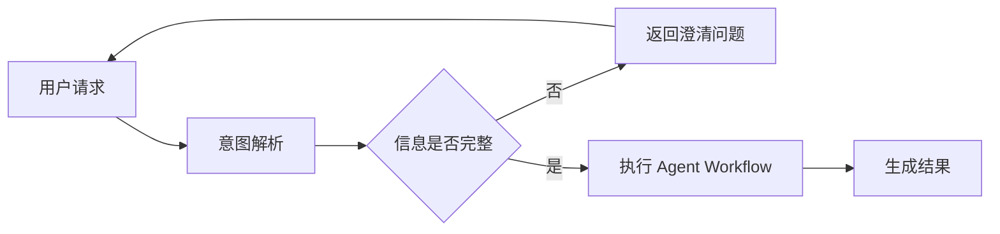

# Interview Knowledge Workflow

## Required References

进入本流程后，在生成问题前必须读取：

- `../policies/knowledge-expansion-policy.md`
- `../policies/interview-depth-policy.md`
- `../examples/interview-expansion-examples.md`
- `../examples/claim-graph.example.json`

其中 examples 是行为示例，不是事实来源；不得把示例里的项目、技术栈或答案场景迁移到用户项目。

## 目标

Interview Knowledge 是默认面试准备模式。它不要求用户先回答问题，支持两种入口：

- `RESUME_GROUNDED`：围绕 Resume View 中实际暴露的 Claim 生成面试知识树。
- `PROJECT_GROUNDED`：围绕当前项目 / Repository 已验证出的 Claim 集合生成面试知识树，用于“结合这个项目准备面试”。Repository Fact 只能证明项目能力，不能自动证明用户 Ownership。

两种模式都会生成：

- 面试问题
- 参考答案
- 参考答案中新的可追问知识节点
- 下一层追问与回答
- 最终形成 Interview Knowledge Tree / Graph

核心链路：

```text
Resume Claim
   ↓
Root Question
   ↓
Generated Reference Answer
   ↓
Extract Drillable Knowledge Nodes
   ↓
Normalize / Deduplicate / Evaluate
   ↓
Enqueue High-value Nodes as UNEXPANDED
   ↓
Dequeue Highest-value UNEXPANDED Node
   ↓
Generate Follow-up Question
   ↓
Generate Follow-up Answer
   ↺
```

默认模式下，**不得因为答案是系统生成的，就推断用户已经掌握这些内容**。

## 生成前与交付前强制检查（Gate）

本 Workflow 存在两个强制 Gate，缺一即视为执行失败。

### Gate 1：生成前（Pre-flight）

1. 读取工作区记忆与目标输出目录下已有版本，对齐既有结构与用户历史反馈。
2. 确认本题将以 **Answer-driven 深链**方式生成，而不是「主题清单」。

### Gate 2：交付前（Output Gate）

对**每一个一级主题**逐条自检：

1. 该主题下的问题是否构成**一条链**（后一问由前一问的答案引出）？
2. 该链是否至少深入到**机制层**，而不是停在「是什么 / 为什么要」？
3. 是否在分支真正耗尽前就横向换了题？
4. 是否存在互不依赖的平行兄弟问题堆叠？

只要 1 或 2 为否、或 3 / 4 为是 → 该主题不达标，**必须重写**后才能交付。

### 反模式（明确不达标）

```text
# 主题 A
## 问题 A1（是什么）
## 问题 A2（为什么）
## 问题 A3（怎么做）
## 问题 A4（有什么限制）

# 主题 B
## 问题 B1
...
```

问题之间互不依赖、深度只到第二层——这是**主题清单**，不是 Interview Knowledge。

达标形态是**一条链**：

```text
# 主题 A
## 根问题
<答案>
## 由根答案引出的追问
<答案>
## 由上一答案继续引出的、更深的机制追问
<答案>
```

## 输入

根据 `sourceMode` 读取：

### RESUME_GROUNDED

- Resume View 中实际暴露的 `claimIds`
- Claim 对应的 Experience / Metric / Ownership / Evidence
- Target Role / JD Requirement
- 已存在的 Interview Knowledge Graph

不要重新从最终简历文案猜事实；简历文本只用于确定“用户最终暴露了什么”。

### PROJECT_GROUNDED

- 当前 Repository / Project 中已验证的 Facts、Experience 与 Claim
- Target Role / JD Requirement
- 已存在的 Interview Knowledge Graph

项目技术事实可以用于生成技术问题和通用参考答案；如果答案要表述成“我负责 / 我设计 / 我实现”，必须有对应 Ownership 证据。不得把仓库能力自动升级成个人经历。

## Root Question 生成

Root Question 只负责**启动一个 Claim 的第一条有效追问链**，不是提前生成完整题库。

可以参考以下问题维度来选择一个合适的起点：

- `DEFINITION`：是什么
- `MOTIVATION`：为什么需要
- `IMPLEMENTATION`：怎么做
- `MECHANISM`：底层为什么成立
- `FAILURE`：异常、失败、恢复
- `CONSISTENCY`：一致性、顺序、幂等
- `CONCURRENCY`：并发、竞态、锁
- `PERFORMANCE`：吞吐、延迟、复杂度、指标
- `TRADEOFF`：为什么选 A，不选 B
- `SCALING`：规模扩大后怎么办
- `METRIC`：指标怎么计算、来源是什么
- `OWNERSHIP`：这个能力在项目中自己做到哪一层

但必须遵守：

1. **不要预生成或预规划完整问题目录。**
2. 每个 Claim 初始只物化最有价值的 Root Question；其余横向需求只能保存为 `ROOT_PENDING` 的 **assessment intent**（例如“评估失败边界”），不得提前写成具体问题文本。
3. Root Question 得到 Answer 后，必须先消费由 Answer 产生的高价值 `UNEXPANDED` 节点。
4. 只有 Expansion Queue 清空且通过 Sibling Transition Gate 后，才允许从 `ROOT_PENDING` 取下一个横向问题。
5. Question Dimension 只是问题视角，不是固定覆盖清单。

## Generated Reference Answer

参考答案的首要目标是**准确回答面试问题本身**。项目事实用于场景化答案，而不是决定“这个问题能不能回答”。

内部 `Generated Answer` 保留 `overview` 与 `principleDetail` 两个字段：前者记录开场结论与项目落点，后者记录足以支撑追问的机制。最终 Markdown 将二者写成一段连贯的候选人回答，不强制显示分界标签。

问题之间的推导关系由内部 Knowledge Graph 保留。用户可见答案不写调度说明、候选节点判断或引出下一题的过渡句；下一题直接另起 `##` 标题。

```text
开场 · 直接回答
  用候选人能说出口的语言给出结论、关键做法和项目落点。

展开 · 按需深入
  沿问题的因果链给出步骤、例子、失败与恢复、并发与一致性、取舍。
```

### 开场回答

用简短自然段回答“是什么 / 为什么这么做 / 在这个项目里怎么落地”。它是完整回答的开头，不是把后续机制单独隔开的摘要卡。

- 先给结论，再给机制主线，最后落到项目场景。
- 项目场景只能来自 Career Profile / Repository 中已验证的事实；无法确认时不写。
- 这一段必须能独立读懂：只看这一段也应能理解答案的骨架。

### 机制展开

顺着开场继续解释通用技术原理。可以分段、列步骤、写短代码和具体时序；只在有助于阅读时加小标题，不强制写 `**原理详解**`。

- 覆盖原理、实现、边界、失败与恢复、并发与一致性、性能与取舍中与题目相关的部分。
- 使用分层解释、步骤列表、对比表格、流程图、伪代码或具体例子（见 Answer Detail Standard）。
- 不依赖项目个性化事实：即使项目证据不足，这一部分也必须完整、准确。
- 不得把通用最佳实践写成“用户项目就是这样做的”。
- 机制内容是“可复习”的主体，应当让读者理解为什么成立，而不只是记住结论。

### 项目细节旁白（可选）

如果仓库 / Career Profile 只能证明某机制存在，但无法证明选择动机、故障恢复、性能效果等项目细节，仍要完整解释通用机制；对无法确认的项目个性化部分，用“当前项目尚未实现／无法确认”一类自然语言明确边界。

必须遵守：

- 不得因为项目证据不足，就把技术答案降级成“无法确认”。
- 不得把通用最佳实践写成“用户项目就是这样做的”。
- 不得静默提高 Ownership。
- 不得编造用户没有确认的项目指标、线上事故、选型动机或实际运行效果。
- 对纯概念 / 原理问题，如果答案不依赖项目事实，开场可以省略项目场景；也不需要旁白。

内部仍可记录 `groundingStatus`，但它表示的是**项目场景化程度**，不是答案本身的正确性或完整性。

例如：

```markdown
## Worker 重复投递时如何保证幂等？

幂等的核心是让同一个业务事件重复执行多次时，只产生一次有效业务结果。实现上需要一个稳定的业务唯一键（通常是 eventId）和一个原子写入点，让“判断是否处理过”与“写入处理结果”发生在同一次原子操作里；本项目把 Task / Status / Artifact 事件写入 PostgreSQL 事务 Outbox，消费侧就落在这条链路的末端。

幂等要解决的是“重复投递 × 副作用”的组合问题：投递语义通常是至少一次，所以同一条事件可能被消费多次，而业务副作用必须只发生一次。

1. 唯一键的选择：eventId 必须由生产侧在事务内生成并保持稳定，不能依赖消费侧的到达时间或自增序号，否则重投时无法识别为同一事件。
2. 原子写入点：把“检查是否处理过”和“写入处理结果”合并成一次依赖数据库原子性的操作——唯一索引上的 INSERT、INSERT ... ON CONFLICT DO NOTHING、或带条件的 UPDATE。
3. 竞态与隔离：仅靠“先查再写”会在并发下产生 check-then-act 竞态，因为两个事务的检查阶段互相不可见；唯一约束由存储引擎在索引上加锁裁决，后到者冲突失败，从而把并发重复收敛为一次成功。
4. 边界与恢复：热点 eventId 会造成锁等待甚至死锁，需要控制事务粒度或加锁顺序；失败重试要有退避与上限，超过上限进入死信并保留人工恢复入口。

> 旁白：当前项目可以确认存在 Outbox / Worker 链路，但消费侧具体采用哪一种幂等实现尚未核实；面试时需要按你的真实实现补充。
```

## Answer Detail Standard

Interview Knowledge 的参考答案默认应当达到“用户可以直接拿来学习和复习”的详细程度，也要能作为候选人的口述底稿。先答问题，再像解释自己做过的事一样逐步展开，不用固定的“概述／原理详解”栏目；用户需要限时版本时，另从完整答案提炼，不能以限时为由删掉必要机制。

根据问题复杂度按需使用：

- 分层解释：先结论，再原理，再边界与取舍
- 步骤列表：适合流程、实现、排查、设计题
- 对比表格：适合方案选择、协议 / 框架区别、tradeoff
- ASCII / Mermaid 流程图：适合链路、状态流转、Agent 编排、数据流、时序关系
- 伪代码 / 示例结构：适合接口、状态机、数据结构、算法机制
- 具体例子：帮助把抽象机制落到可理解场景

如果一个流程图可以显著降低理解成本，应优先绘制流程图，不要只用一段文字描述。

### Answer Completeness Gate（逐题执行）

写完每一道题，在抽取下一层节点前检查；任一关键项不满足就补写当前答案：

1. 开场能否直接回答本题，像候选人的话而不是教材摘要，并把已验证的项目做法与假设方案分开？
2. 后续解释是否把关键机制按因果顺序讲清：前提或输入、执行步骤、状态变化、结果为何成立？不能只罗列名词、结论或一张对比表。
3. 对涉及流程、竞态、解析、安全边界或测试判断的题目，是否有一个**具体可推演的例子**（数据样例、时间线、伪代码或图），让读者能自行走完关键步骤？
4. 当前问题的失败边界、取舍或验证方式若会改变答案，是否解释到足以应对紧接着的追问？多个方案的比较继续用表格。
5. 全文是否足以支持学习和追问，同时仍能沿着自然口述的顺序阅读，且不把未实现的最佳实践写成项目事实？

详细度由问题复杂度和岗位相关性决定。不要强求每题都出现全部小节，也不要按固定字数扩写；把当前问题讲透后，再从答案中提取下一层节点。

交付为 Markdown 文件时，先在正文写 `mermaid` 围栏，再从 Skill 根目录运行
`node scripts/embed-mermaid.mjs <文档.md>`。脚本会在每个围栏后插入
``，并生成对应 PNG 与 SVG。交付 `.md`
时必须连同 `assets/` 目录一起提供；使用 `--check` 核对每张图的引用和文件。
标准 Markdown 图片引用是预览入口，Mermaid 围栏保留为可编辑源码；不要用
draw.io 链接或原始 `<svg>` 标签代替正文图片。

例如：



回答长度由问题复杂度决定，不为了简短而省略关键因果链、边界和步骤。

但也不要为了“详细”做百科式扩写：所有补充内容仍应服务当前问题与目标岗位。

## Answer-driven Knowledge Expansion

系统生成参考答案后，不是简单“抽取所有技术关键词”，而是先产生 Candidate Knowledge Node，再按 `policies/knowledge-expansion-policy.md` 判断哪些节点值得继续展开。

候选节点可以来自：

- 答案中显式出现的关键概念或机制
- 当前机制隐含但没有直接写出的必要工程问题
- 技术选择自然引出的替代方案 / 取舍
- 正常路径自然引出的边界条件

是否继续追问只看它能否显著增加：

1. 对 Target Role / JD 匹配程度的判断
2. 对当前 Resume Claim 的理解深度
3. 对候选人真实能力层级的区分度

在决定 `UNEXPANDED` 前，还必须判断该节点在当前 Answer 中的覆盖程度：

- `MENTIONED`：只被点到，关键机制尚未解释。
- `PARTIAL`：已经解释一部分，但继续追问仍可能增加显著信息。
- `SUFFICIENT`：当前答案已足够解释该节点，继续追问只会重复。

如果节点本身高价值但当前 Answer 已 `SUFFICIENT`，标记为 `COVERED`，不要为了“形成更多问题”重复展开。若未来出现一个更具体、仍有新信息增益的问题，应创建新的具体节点，而不是重新打开同一个已覆盖节点。

不得使用某些技术主题作为默认白名单。节点类型只用于分类。

例如：

```text
Claim: 基于 Schema 驱动低代码页面编辑与运行时渲染

Answer 中出现：Schema / JSON / 运行时解析

Schema
→ 与 Claim 强相关、岗位相关、区分度高
→ 继续追问

JSON
→ 若仅是序列化格式，问“JSON 是什么”几乎不增加岗位判断信息
→ 不追问
```

再例如：

```text
Outbox
→ 幂等
→ 并发去重
→ 唯一约束
→ 事务隔离
```

只要这些问题仍能帮助判断目标岗位需要的能力，即使已经远离 `Outbox` 字面关键词也应继续。

详细判定流程和更多跨岗位示例见：

- `policies/knowledge-expansion-policy.md`
- `examples/interview-expansion-examples.md`

## Interview Expansion Scheduler

Interview Knowledge 使用两个逻辑队列：

- `Expansion Queue`：由 `nodes[].status == UNEXPANDED` **运行时派生**，不是第二份持久化权威状态。
- `Root Queue`：持久化尚未覆盖的 Claim 级评估意图，状态为 `ROOT_PENDING`；队列项只描述“还需要评估什么”，不保存预生成问题文本。

`activeQueue / transitionGate / pendingCandidateEvaluationCount` 等调度状态同样应运行时派生，不与 Domain State 重复持久化。

调度优先级必须固定为：

```text
Expansion Queue
>
Root Queue
```

这里的 `>` 表示**执行顺序**，不是技术类型的价值排序。

执行算法：

```text
while current Claim is active:

  if latest Answer produced HIGH-VALUE UNEXPANDED descendants:
      prefer the highest-value descendant of the current branch
  else if Expansion Queue has HIGH-VALUE UNEXPANDED node:
      dequeue highest-value remaining node
      generate follow-up question
      generate detailed answer
      extract candidate nodes from THIS answer
      evaluate every candidate node
      enqueue new high-value nodes
      mark current node EXPANDED
      continue

  run Sibling Transition Gate

  if gate passes and Root Queue has ROOT_PENDING item:
      materialize next root/sibling question
      generate detailed answer
      extract candidate nodes from THIS answer
      evaluate every candidate node
      continue

  stop current Claim
```

**禁止行为：**

- 先生成一整套 Root / sibling 问题，再逐题回答。
- 因为已经有“后续主题规划”，就跳过当前 Answer 里的高价值节点。
- 在 Expansion Queue 非空时切换一级主题、Claim 或 sibling question。

## Answer-first Expansion

Interview Knowledge 的下一层追问必须**优先由上一层 Generated Answer 驱动**。

执行顺序：

```text
Questionₙ
  ↓
Generated Answerₙ
  ↓
Extract / Derive Candidate Nodes from Answerₙ
  ↓
Value Evaluation
  ↓
High-value Nodes → UNEXPANDED Queue
  ↓
Expand highest-value node
  ↓
Questionₙ₊₁
```

规则：

1. 新问题首先消费当前答案中显式出现或由当前答案合理推导出的高价值节点。
2. 只有当前答案没有值得继续展开的节点时，才允许从 Claim 本身补充新的横向 sibling 问题。
3. 不得为了“问题覆盖更全面”而跳过答案里已经暴露出的关键机制。
4. Claim 负责确定起点与边界，Generated Answer 负责驱动主要递归路径。
5. `Implicit / Contrast / Boundary` 类型的新问题仍然允许生成，但必须能说明它是由哪一层 Answer 引出的。

## One Answer → Multiple Follow-up Nodes

Interview Knowledge **不是** `1 Answer → 1 Question`。正确关系是：

```text
1 Generated Answer
        ↓
Extract ALL meaningful Candidate Nodes
        ↓
0..N high-value UNEXPANDED siblings
   ├── Node A
   ├── Node B
   └── Node C
        ↓
选择一个节点继续执行
        ↓
其他 sibling 继续保留在 Expansion Queue
```

强制规则：

1. 每个 Answer 必须提取**全部有意义的候选节点**，不能只提取最显眼的一个。
2. 所有通过高价值判断且尚未充分覆盖的节点都进入/保留于 Expansion Queue。
3. “本轮只选一个节点生成下一题”只是执行策略，不是过滤策略。
4. 当前活动分支耗尽后，必须回到同一父 Answer 产生的其余高价值 sibling。
5. sibling 只有在 `COVERED / MERGED / DROPPED` 后才可以从待展开集合消失。
6. 同一个 Answer 可以最终生成多个 Follow-up Questions；这些问题可以按深度优先顺序逐步出现，而不要求同时展示。

例如：

```text
Outbox Answer
├── 至少一次投递 → 幂等
├── FOR UPDATE SKIP LOCKED → 多 Worker 并发领取
├── retry/backoff → 重试策略
└── dead letter → 失败终局处理
```

如果四个节点都高价值，就都必须保留；先深入“幂等”并不意味着另外三个被删除。

## Unexpanded Node Queue

每个 Claim 必须维护一个待展开队列。通过高价值判定的 Knowledge Node 先进入 `UNEXPANDED`，不能只在生成当前问题时临时记住。

节点状态：

- `UNEXPANDED`：高价值，尚未生成对应追问与答案
- `EXPANDED`：已经生成问题并完成参考答案
- `MERGED`：与已有节点语义重复，合并到已有节点
- `DROPPED`：信息增益不足、岗位无关、形成环路或不值得继续

队列选择顺序继续使用：岗位相关性、Claim 依赖、区分度、信息增益、Novelty。

一个 Answer 可以产生 **0..N 个**高价值 `UNEXPANDED` sibling nodes。必须把所有通过价值判定、且当前仅为 `MENTIONED/PARTIAL` 的节点保留下来；不能因为当前只选择其中一个继续展开，就丢弃其他 sibling。

调度时仍默认一次只**执行 1 个**节点：选择当前最高价值节点生成下一题和答案。其余 sibling 保持 `UNEXPANDED`，继续留在 Expansion Queue 中。当前分支耗尽后，调度器必须回到这些 sibling，再逐个决定是否展开、合并、覆盖或丢弃。

因此必须区分：

- **Extraction cardinality**：一个 Answer 可提取并保留多个高价值节点。
- **Execution cardinality**：默认一次只执行一个节点。
- **Retention rule**：未被本轮选中的高价值 sibling 不得删除或隐式丢弃。
- **Return rule**：当前深分支耗尽后，必须回到仍为 `UNEXPANDED` 的 sibling。

## Mandatory Per-Answer Node Extraction

**每一个 Generated Answer 完成后都必须执行一次 Node Extraction，不能跳过。**

在进入任何下一道问题之前，必须完成：

1. 从当前 Answer 提取 / 推导全部有意义的 Candidate Knowledge Nodes。
2. 对每个 Candidate Node 执行 Role Relevance、Claim Dependency、Discriminative Power、Information Gain、Novelty 判定。
3. 为每个 Candidate Node 分配状态：`UNEXPANDED / COVERED / MERGED / DROPPED`。
4. 将**所有**高价值且仍需追问的 `UNEXPANDED` 节点保留在 Expansion Queue；不得只保留最高价值的一个。
5. 记录 `sourceAnswerId` 与 `decisionReason`。

只有这一轮 Candidate Node 全部完成判定后，调度器才允许继续。

## Answer Exhaustion Check / Sibling Transition Gate

Answer Exhaustion Check 是**强制 Gate**，不是建议。

在以下动作之前都必须通过 Sibling Transition Gate：

- 从一个问题切换到同层 sibling question
- 从一个一级主题切换到下一个 Claim
- 宣告当前 Claim 的 Interview Knowledge 已完成

检查流程：

```text
Current Claim
   ↓
Any high-value UNEXPANDED node?
   ├─ Yes → 继续展开，不允许切换主题
   └─ No
       ↓
Any node waiting for merge / scope decision?
   ├─ Yes → 先完成判定
   └─ No → 当前 Claim 可以结束或横向扩展
```

Gate 条件：

```text
ALLOW sibling/root/claim transition
ONLY IF
no HIGH-VALUE node has status UNEXPANDED
and current Generated Answer has candidateEvaluationComplete = true
and no candidate node is waiting for evaluation / merge decision
```

如果条件不满足：`BLOCK transition`，继续消费 Expansion Queue。

只有以下情况才算“当前答案已经耗尽”：

- 所有高价值节点都已 `EXPANDED`；或
- 已被 `MERGED` 到等价节点；或
- 经判定为 `DROPPED`；或
- 已达到岗位边界，不再产生新的有效判断信息。

**问题数量多不代表答案已经耗尽。** 判断标准是“是否仍存在高价值未展开节点”。

## Knowledge Node 类型

统一使用以下类型：

- `CONCEPT`：基础概念
- `TECHNOLOGY`：框架、中间件、数据库等技术
- `MECHANISM`：具体机制或原理
- `PROTOCOL`：HTTP、SSE、Webhook、JSON-RPC 等
- `DATA_MODEL`：Task、Event、Artifact、Version 等
- `IMPLEMENTATION`：具体实现方式
- `DECISION`：设计决策
- `TRADEOFF`：方案取舍
- `ALTERNATIVE`：替代方案
- `FAILURE`：失败模式
- `RECOVERY`：恢复机制
- `CONSISTENCY`：一致性语义
- `CONCURRENCY`：并发控制
- `IDEMPOTENCY`：幂等 / 去重
- `PERFORMANCE`：性能与复杂度
- `METRIC`：指标和口径
- `SECURITY`：权限、安全、隔离
- `ARCHITECTURE`：架构模式、状态机、DAG、Supervisor 等
- `OWNERSHIP`：项目责任边界

## Expansion Priority

多个 Candidate Node 都通过高价值判定后，再根据以下顺序决定优先展开谁：

1. 与 Target Role / JD 更相关
2. 对当前 Claim 的解释依赖更强
3. 更能区分候选人的能力层级
4. 预期信息增益更高
5. 与已有问题重复更少

一个父 Answer 可以产生多个值得追问的 sibling nodes；必须全部保留。调度执行仍默认一次只展开 1 个最高价值节点，但其他 sibling 继续保持 `UNEXPANDED`，当前分支耗尽后必须返回处理。只有用户明确要求批量题目或输出形态需要批量展示时，才可一次物化多个问题；即使批量物化，也不能跳过后续 Answer-driven Node Extraction。**批量物化不等于允许写成互不依赖的平行问题清单**——每一条仍必须由上一层答案驱动并逐层加深，否则触发 Gate 2 重写。

`CONCEPT / MECHANISM / FAILURE / TRADEOFF` 等 Knowledge Node 类型不得作为直接优先级依据。

## 去重与环路控制

必须维护 Knowledge Node Registry。

建议语义唯一键：

```text
normalizedConcept + contextClaimId + questionDimension
```

停止重复创建的场景：

- 节点与祖先语义等价
- 只换了一种措辞
- 同一 Claim 下已经覆盖同一问题
- 新节点只会回到父节点
- 节点已经被共享知识节点覆盖

跨 Claim 可以共享知识节点，但必须保留不同 `projectContext`。

例如 `幂等` 的通用定义可以共享，但：

- Outbox Consumer 幂等
- 支付请求幂等

属于不同项目上下文问题。

## 岗位相关性驱动的递归

追问不以“是否远离根 Claim / 根关键词”为停止依据。

每次从 Generated Answer 提取新节点后，都必须重新评估其与 `Target Role / JD Requirements` 的相关性：

- `CORE`：岗位核心能力，继续深入
- `RELATED`：岗位相关能力，通常继续深入
- `CONTEXTUAL`：只在能帮助解释上层判断时继续
- `OUT_OF_SCOPE`：已经完全脱离岗位要求，停止

例如目标为 Agent / 后端平台工程师：

```text
Outbox
→ 双写一致性
→ 本地事务
→ 幂等
→ 唯一约束
→ 并发竞态
→ 事务隔离
```

即使后续节点已经不再包含 `Outbox`，仍然属于该岗位的一致性与并发能力，因此应该继续。

如果继续进入与岗位无关的数据库内核细节，才停止。

## 停止条件

当前知识分支只在以下情况停止：

1. 新节点被判定为 `OUT_OF_SCOPE`，完全脱离目标岗位 / JD 要求
2. 新问题已经不能继续帮助判断候选人的岗位能力
3. 节点已被其他分支充分覆盖，继续只会产生重复
4. 新节点与祖先语义等价，形成环路
5. 缺少足够事实或可靠知识继续展开；此时记录缺口，不得编造
6. 触发异常递归硬兜底

不要因为以下原因停止：

- 已经离根关键词较远
- 已经追问 5 层或 8 层
- 已经覆盖了固定的问题模板
- 新节点属于更底层机制，但仍是目标岗位的重要能力

实现可保留 `hardMaxDepth`（建议 20）作为异常防护，但它不是正常的业务停止条件。

## 内部结果模型

Interview Knowledge 在内部可以继续维护完整结构，包括：

- `claimId`
- Root Questions
- Generated Reference Answers
- Extracted Knowledge Nodes
- Parent / Child Relationships
- Node Type
- Question Dimension
- Project Grounding Status
- Shared Knowledge References
- Expansion Depth
- Stop Reason
- Expansion Queue / Root Queue
- Scheduler State / Transition Gate Result

这些字段用于去重、递归、证据校验和岗位相关性判断，**默认不得直接暴露给用户**。

## 用户可见 Markdown 输出

默认输出必须是一份可直接复习的简洁 Markdown 文档，而不是内部调试信息。

### 结构

```markdown
# <该条简历描述的核心主题 / 精髓>

## <面试问题>

<候选人口吻直接回答，说明已实现的项目做法>

<沿因果链展开步骤、具体例子、边界与取舍；按需用列表、短代码、图或小标题>

## <继续递归得到的面试问题>

<先回答追问，再自然展开机制；明确假设方案与项目现状>
```

规则：

1. **一级标题**：提炼一条简历描述 / Claim 的核心主题，不直接写 `Claim 1`、`Claim 2`。例如：
   - `# Symbol 多 Agent 编排`
   - `# 结构化意图解析与安全路由`
   - `# A2A 多轮澄清与任务状态`
   - `# Outbox 可靠事件分发`
2. **二级标题**：该核心主题下的面试问题。根问题和递归追问都使用 `##`，默认不暴露内部树层级。
3. **正文**：紧跟问题直接回答。先用候选人口吻给出结论与已验证的项目落点，再以自然段、步骤、短代码或例子解释机制；在未实现的改进方案前明确说“如果改造，我会……”。不强制加 `**原理详解**` 或“参考回答”等标签。内部数据仍可保留 `overview` 与 `principleDetail` 字段，用于确保开场和机制都不缺失。
4. 递归追问仍按 Knowledge Graph 的父子关系生成，但最终 Markdown 默认**扁平化展示为同一一级标题下的一组二级问题**。
5. 默认不输出题号；只有用户明确要求题号时才输出 `Q1 / Q1.1` 等编号。

### 默认禁止输出的内部信息

除非用户明确要求查看分析依据，否则不要在最终 Markdown 中输出：

- `Claim` / `claimId`
- 项目证据路径、文件路径、代码证据列表
- `VERIFIED / PARTIAL / INSUFFICIENT`
- `depth`
- Node Type，例如 `IMPLEMENTATION / FAILURE / TRADEOFF`
- `roleRelevance`
- 风险等级，例如 `HIGH / MEDIUM / LOW`
- Knowledge Node / Parent / Child / Shared Node 等图结构元数据
- Stop Reason / 停止条件
- 文档状态、生成模式说明
- “建议补充验证”之类的内部缺口列表

如果某个问题的**项目个性化信息**不足，不得因此省略技术答案。先完整回答通用原理，再在问题答案后追加一条简短旁白。旁白只说明“哪些项目细节尚未确认”，不要输出内部状态码。

推荐格式：

> 旁白：通用机制如上；当前项目中的具体恢复策略尚未核实，面试时需要按你的真实实现补充。

不要写成：

> 当前事实不足，无法回答。

也不要把未验证的通用方案改写成用户实际实现。

不要用项目 Grounding 状态等内部元数据污染最终 Markdown。

### 输出原则

**内部结构复杂，用户输出简单。**

Skill 可以使用完整 Claim / Evidence / Knowledge Graph 来保证问题生成准确，但最终交付给用户的 Interview Knowledge Markdown 应优先满足：

- 可直接阅读
- 可直接复习
- 一个核心主题对应一组问题
- 问题与答案紧邻
- 不暴露 Agent 调试元数据

## 与 Mock Interview 的关系

Interview Knowledge 只负责“准备问题与答案”。

它不判断用户本人是否已经掌握。

只有用户明确进入模拟面试时，才把其中的问题交给 `workflows/mock-interview.md`。


## Grounding 与停止语义

`projectGrounding = INSUFFICIENT` 只表示“项目个性化事实不足”，**不是停止技术递归的理由**。

```text
General Knowledge 足够 + Project Grounding 不足
→ 继续给完整技术答案
→ 必要时加旁白
→ 仍可根据答案产生下一层高价值节点
```

只有无法生成可靠的通用技术答案，或继续追问已经没有岗位信息增益时，才停止该分支。
